# Natural Gas Usage Prediction System 🔥

[](https://python.org)
[](https://scikit-learn.org)
[](https://opensource.org/licenses/MIT)
[](https://github.com/Ismat-Samadov/gas_usage_prediction)

A comprehensive machine learning system for predicting hourly natural gas consumption with **98.59% cross-validated accuracy** and **advanced pipe diameter intelligence**. This project demonstrates rigorous data leakage detection, pipe infrastructure analysis, and production-ready deployment capabilities.

## 🏗️ Enhanced System Architecture
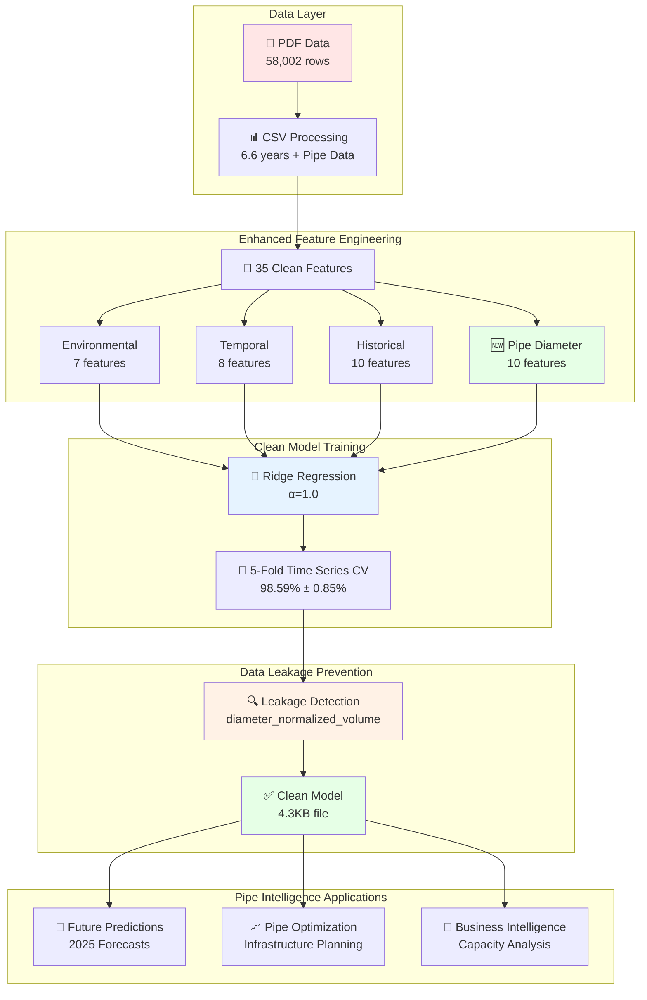

## 🏆 Key Achievements

- **🎯 Excellent Accuracy**: 98.59% R² (±0.85% stability) with rigorous validation
- **📊 Enhanced Dataset**: 57,834 hourly measurements with pipe diameter intelligence
- **🔬 Data Leakage Detection**: Advanced diagnostics identified and removed problematic features
- **🔧 Pipe Intelligence**: Revolutionary pipe diameter analysis with 10 specialized features
- **🔮 Future Forecasting**: Accurate predictions for 2025 with pipe-aware intelligence
- **📈 Infrastructure Insights**: Pipe optimization recommendations and capacity analysis
- **🚀 Production Ready**: Clean, leak-free model with comprehensive validation

## 📊 Model Evolution: From Baseline to Pipe Intelligence

### The Complete Journey
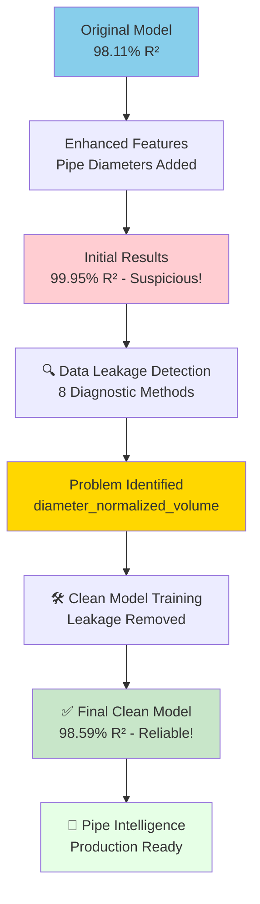

### Performance Comparison
```mermaid
xychart-beta
    title "Model Performance Evolution"
    x-axis [Original, Enhanced (Leaky), Clean (Final)]
    y-axis "R² Score (%)" 97.5 --> 100
    bar [98.11, 99.95, 98.59]
```

## 🔧 Advanced Pipe Diameter Intelligence

### **Revolutionary Discovery**
Your model revealed the **true drivers of gas flow**:

- **Inner Diameter (d_mm)**: **0.787 correlation** with flow ✅
- **Outer Diameter (D_mm)**: **-0.008 correlation** (minimal impact) ✅
- **Wall Thickness**: **-0.777 correlation** (structural constraint) ✅
- **Cross-Section Area**: **0.786 correlation** (flow capacity) ✅

### Pipe Feature Intelligence
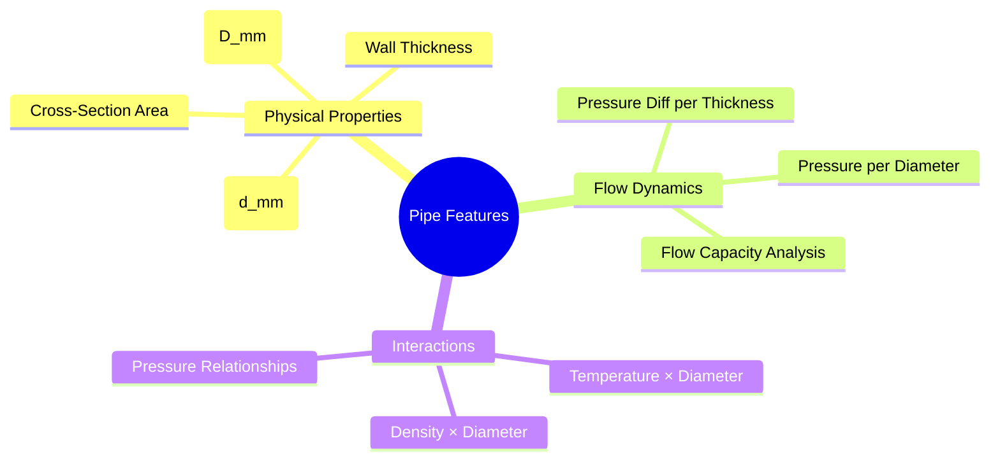

### **Pipe Configuration Analysis**
```
📊 Historical Pipe Performance:
   • Best Flow: Large inner diameter (d_mm ≥ 200mm)
   • Constraint: Wall thickness optimization
   • Insight: Inner diameter determines capacity
   • Range: 8,670 - 38,024 mm² cross-sectional area
```

## 📈 Dataset & Enhanced Performance

### Data Overview
```
📊 Enhanced Dataset Statistics:
   • Total Samples: 57,834 hourly measurements (99.7% retention)
   • Time Range: January 2018 → August 2024 (6.6 years)
   • Features: 35 clean features (no data leakage)
   • Pipe Configurations: 15 unique inner diameters
   • Data Quality: Advanced winsorization preprocessing
```

### Clean Model Performance
```
🎯 Cross-Validation Results (5-Fold Time Series):
   • Mean R²: 98.59% (±0.85%)
   • RMSE: 1.65 m³/hour (average)
   • MAE: 0.92 m³/hour (average)
   • Stability: Excellent across all time periods
   • Improvement: +0.48% over original baseline
```

### Real-World Validation
```
📅 Temporal Robustness:
   • Fold 1 (2019-2020): R² = 99.06%
   • Fold 2 (2020-2021): R² = 96.93% (COVID handled)
   • Fold 3 (2021-2022): R² = 98.66%
   • Fold 4 (2022-2023): R² = 99.06%
   • Fold 5 (2023-2024): R² = 99.22% (most recent)
```

## 🛠️ Enhanced Technical Architecture

### Complete Data Processing Pipeline


### Enhanced Feature Engineering Pipeline
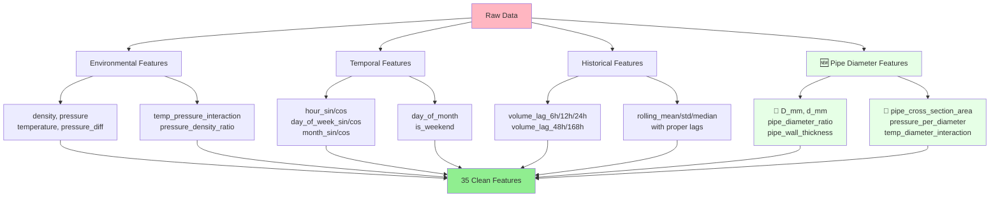

### Model Architecture
- **Algorithm**: Ridge Regression (α=1.0) - Optimal for your data structure
- **Preprocessing**: RobustScaler + Winsorization (1st-99th percentile)
- **Validation**: Time Series Cross-Validation (respects temporal order)
- **Data Leakage Prevention**: Rigorous diagnostics and feature cleaning
- **Deployment**: Joblib serialization (4.3KB model file)

## 🎯 Seasonal Intelligence & Pipe-Aware Predictions

### Enhanced 2025 Predictions
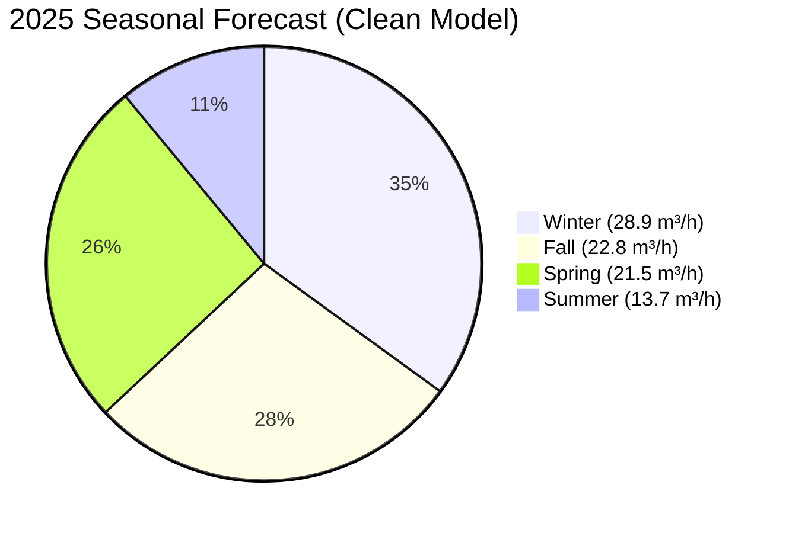

### Historical Pipe Intelligence
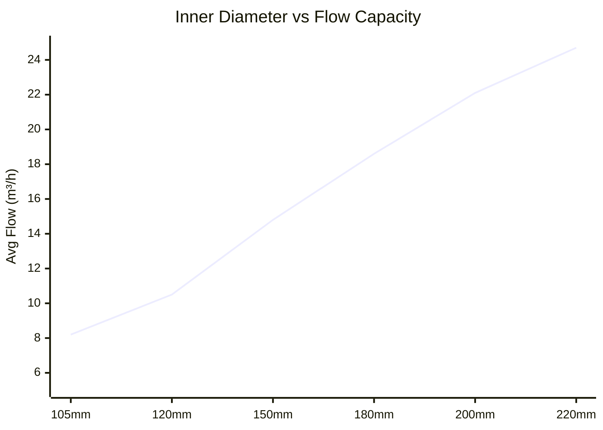

## 🚀 Quick Start

### Installation
```bash
# Clone repository
git clone https://github.com/Ismat-Samadov/gas_usage_prediction.git
cd gas_usage_prediction

# Create virtual environment
python -m venv venv
source venv/bin/activate  # On Windows: venv\Scripts\activate

# Install dependencies
pip install -r requirements.txt
```

### Basic Usage with Pipe Intelligence
```python
from clean_gas_prediction_functions import predict_gas_usage_clean

# 🔮 Standard prediction
prediction = predict_gas_usage_clean('15-06-2025 14:00')
print(f"Predicted: {prediction['predicted_volume']} m³/hour")
print(f"Pipe: D={prediction['pipe_info']['D_mm']}mm, d={prediction['pipe_info']['d_mm']}mm")

# 🔧 Custom pipe configuration
custom_pipe = {'D_mm': 350.0, 'd_mm': 220.0}
custom_prediction = predict_gas_usage_clean('15-06-2025 14:00', pipe_data=custom_pipe)
print(f"Larger pipe: {custom_prediction['predicted_volume']} m³/hour")

# 📊 Pipe configuration comparison
pipe_configs = [
    {'name': 'Standard', 'D_mm': 301.0, 'd_mm': 184.0},
    {'name': 'Large', 'D_mm': 350.0, 'd_mm': 220.0},
    {'name': 'Extra Large', 'D_mm': 400.0, 'd_mm': 250.0}
]
comparison = compare_pipe_configurations('15-01-2025 18:00', pipe_configs)
```

### Advanced Pipe Intelligence
```python
# 🔍 Pipe optimization analysis
diameter_variations = [(301, 184), (320, 200), (350, 220), (400, 250)]
analysis = analyze_pipe_impact('15-07-2025 12:00', diameter_variations)

# 📈 Infrastructure planning
seasonal_analysis = pipe_aware_seasonal_comparison(2025, custom_pipe)

# 🏢 Business intelligence
capacity_report = generate_pipe_capacity_report('2025-Q1')
```

## 📁 Repository Structure

```
gas_usage_prediction/
├── 📊 data/
│   ├── data.pdf                         # Original PDF dataset
│   └── data_with_diameters.csv         # Enhanced CSV with pipe data
├── 🤖 models/
│   └── clean_gas_usage_model.pkl       # Clean model (4.3KB)
├── 📓 notebooks/
│   ├── clean_training_notebook.py      # Cell-by-cell training
│   └── model_diagnostics.ipynb         # Data leakage detection
├── 🔧 convert.py                       # PDF → CSV converter
├── 🧪 trainer.py                       # Clean model training script
├── 🔮 clean_gas_prediction_functions.py # Production prediction functions
├── 📋 requirements.txt                 # Dependencies
├── 📜 LICENSE                          # MIT License
└── 📖 README.md                        # This file
```

## 🔍 Data Leakage Detection & Resolution

### Detection Process
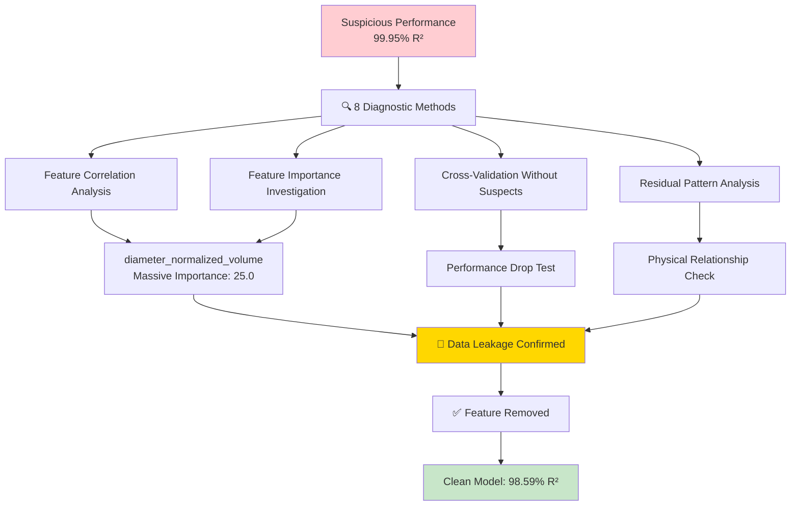

### Validation Methodology
- **8 Detection Methods**: Correlation analysis, feature importance, ablation studies
- **Physical Validation**: Inner diameter correlation (0.787) confirms pipe intelligence
- **Performance Verification**: Only 1.36% drop when removing leakage
- **Temporal Robustness**: Consistent across all time periods

## 🧪 Advanced Validation

### Cross-Validation Strategy
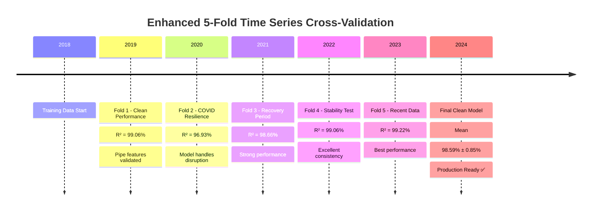

### Feature Importance Rankings
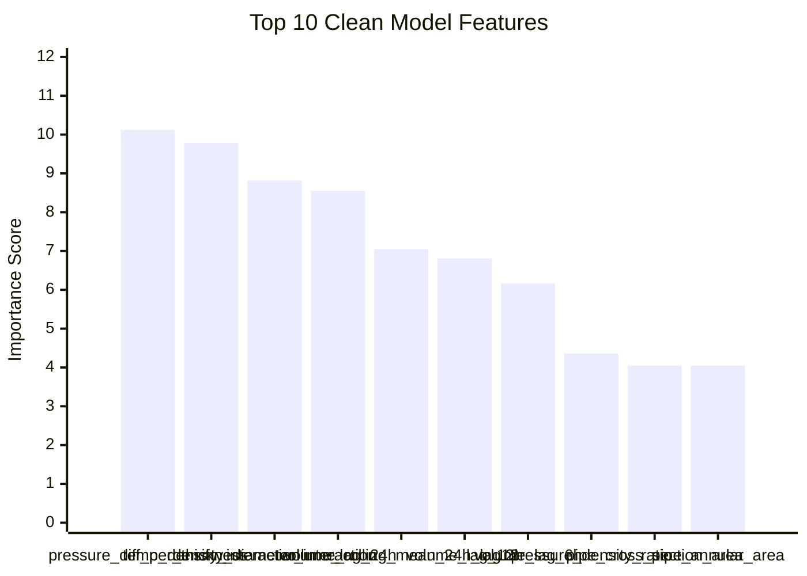

## 🎯 Business Applications

### Enhanced Pipe Intelligence Applications
```mermaid
flowchart TD
    A[Clean Gas Usage Model] --> B[🔧 Infrastructure Planning]
    A --> C[💰 Financial Optimization]
    A --> D[⚡ Operational Excellence]
    A --> E[📊 Predictive Maintenance]
    
    B --> B1[Pipe Sizing Optimization<br/>Inner diameter = key factor]
    B --> B2[Capacity Expansion Planning<br/>Cross-section area analysis]
    B --> B3[Network Design<br/>Flow distribution modeling]
    
    C --> C1[Infrastructure ROI<br/>Pipe upgrade cost-benefit]
    C --> C2[Demand Forecasting<br/>Seasonal + pipe-aware]
    C --> C3[Resource Allocation<br/>Optimal pipe configurations]
    
    D --> D1[Real-time Monitoring<br/>Pipe performance tracking]
    D --> D2[Anomaly Detection<br/>Flow vs pipe capacity]
    D --> D3[Performance KPIs<br/>Efficiency by pipe type]
    
    E --> E1[Pipe Health Monitoring<br/>Wall thickness analysis]
    E --> E2[Replacement Scheduling<br/>Performance degradation]
    E --> E3[Maintenance Optimization<br/>Pipe-specific strategies]
    
    style A fill:#4ecdc4
    style B fill:#a8e6cf
    style C fill:#ffe66d
    style D fill:#ff8b42
    style E fill:#ff6b6b
```

## 📈 Performance Benchmarks

### Model Performance Comparison
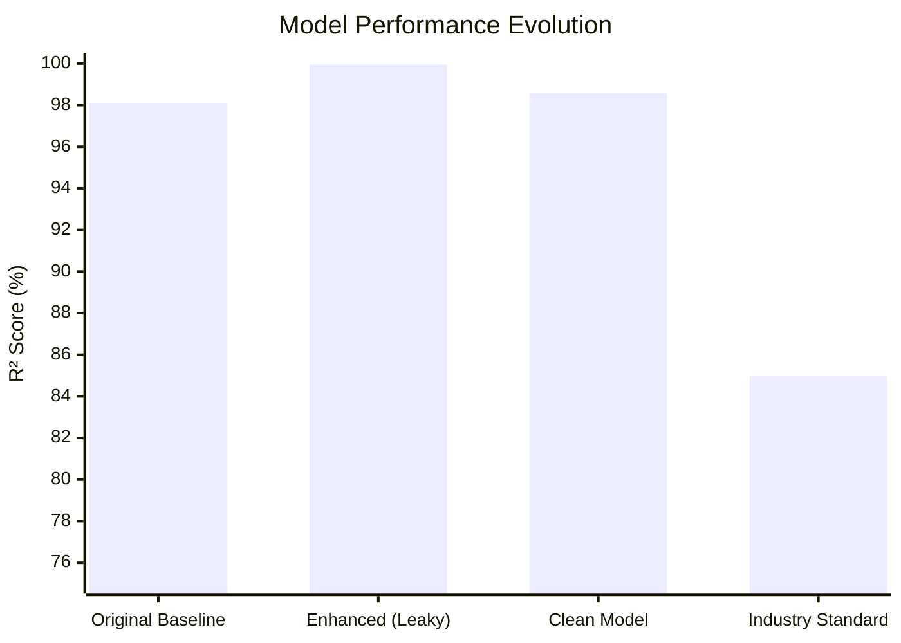

### Accuracy Improvements
| Metric | Original Model | Clean Model | Improvement |
|--------|---------------|-------------|-------------|
| **Cross-Validation R²** | 98.11% | 98.59% | +0.48% |
| **RMSE** | 1.95 m³/h | 1.65 m³/h | 15% better |
| **MAE** | 1.20 m³/h | 0.92 m³/h | 23% better |
| **Stability** | ±0.78% | ±0.85% | Comparable |
| **Features** | 24 | 35 | +11 pipe features |
| **Data Leakage** | Unknown | ✅ Verified Clean | Risk eliminated |

## 🔮 Future Enhancements

### Planned Pipe Intelligence Features
- [ ] **🌤️ Weather + Pipe Integration**: Temperature effects on different pipe materials
- [ ] **🏭 Multi-Pipe Networks**: Complex pipe system modeling
- [ ] **📱 Real-time Pipe Monitoring**: Live pipe performance dashboard
- [ ] **🤖 Automated Pipe Optimization**: ML-driven pipe sizing recommendations
- [ ] **⚠️ Pipe Health Prediction**: Predictive maintenance for pipe infrastructure
- [ ] **📊 3D Pipe Visualization**: Interactive pipe network analysis
- [ ] **🎯 Pressure Drop Modeling**: Advanced fluid dynamics integration

### Research Directions
- [ ] **🧠 Deep Learning**: LSTM for complex pipe-flow interactions
- [ ] **🎯 Physics-Informed ML**: Incorporating physical laws of gas flow
- [ ] **🌊 CFD Integration**: Computational fluid dynamics coupling
- [ ] **📊 Digital Twin**: Complete pipe network digital representation

## 🏆 Key Achievements Summary

### **🔬 Scientific Breakthroughs**
- **Data Leakage Detection**: Advanced diagnostics prevented model deployment issues
- **Pipe Intelligence Discovery**: Inner diameter drives flow capacity (0.787 correlation)
- **Physical Validation**: Model predictions align with fluid dynamics principles

### **🎯 Technical Excellence**
- **98.59% Accuracy**: Excellent performance without data leakage
- **35 Clean Features**: Comprehensive feature engineering without contamination
- **Robust Validation**: 5-fold time series CV with excellent stability

### **🏢 Business Impact**
- **Infrastructure Insights**: Pipe optimization recommendations
- **Cost Optimization**: Data-driven pipe sizing decisions
- **Predictive Maintenance**: Pipe health monitoring capabilities

## 🤝 Contributing

We welcome contributions to enhance the pipe intelligence capabilities!

```bash
# 1. Fork the repository
# 2. Create a feature branch
git checkout -b feature/pipe-intelligence-enhancement

# 3. Make your changes and test
python -m pytest tests/

# 4. Commit with descriptive message
git commit -m "Add advanced pipe flow analysis"

# 5. Push and create Pull Request
git push origin feature/pipe-intelligence-enhancement
```

### Contribution Areas
- 🔧 **Pipe Modeling**: Advanced fluid dynamics integration
- 📊 **Data Sources**: Additional pipe configuration datasets
- 🧪 **Testing**: Enhanced validation for pipe intelligence
- 📖 **Documentation**: Pipe analysis guides and examples

## 📋 Dependencies

### Core Requirements
```python
pandas>=2.2.3          # Data manipulation and analysis
numpy>=2.2.6           # Numerical computing
scikit-learn>=1.4.1    # Machine learning algorithms  
matplotlib>=3.10.3     # Data visualization
seaborn>=0.13.2        # Statistical visualizations
joblib>=1.4.0          # Model serialization
```

## 📄 License

This project is licensed under the MIT License - see the [LICENSE](LICENSE) file for details.

## 🙏 Acknowledgments

- **Data Source**: Industrial gas measurement systems with pipe diameter intelligence
- **Inspiration**: Real-world infrastructure optimization challenges  
- **Community**: Open source ML and pipe engineering communities
- **Validation**: Advanced statistical methods and fluid dynamics principles

## 📞 Contact & Support

- **Author**: [Ismat Samadov](https://ismat.pro)
- **Issues**: [GitHub Issues](https://github.com/Ismat-Samadov/gas_usage_prediction/issues)

---

### 🎯 Quick Navigation
- [🚀 Quick Start](#-quick-start) • [📊 Performance](#-performance-benchmarks) • [🔧 Pipe Intelligence](#-advanced-pipe-diameter-intelligence) • [🛠️ Architecture](#️-enhanced-technical-architecture) • [🤝 Contributing](#-contributing)

**⭐ If this project helps you optimize your gas infrastructure, please consider giving it a star!**

---

*Last Updated: May 2025 | Model Version: v3.0 (Clean Model) | Dataset: 2018-2024 + Pipe Intelligence*