# Natural Gas Usage Prediction System 🔥

[](https://python.org)
[](https://flask.palletsprojects.com)
[](https://scikit-learn.org)
[](https://opensource.org/licenses/MIT)
[](https://gas-usage-prediction.onrender.com)
[](https://gas-usage-prediction.onrender.com)

A comprehensive machine learning system for predicting hourly natural gas consumption with **98.59% cross-validated accuracy**. This full-stack application combines advanced data processing, rigorous feature engineering, and production-ready deployment with a modern web interface.

## 🌐 Live Demo

**Try the live application:** [https://gas-usage-prediction.onrender.com](https://gas-usage-prediction.onrender.com)

Features available in the live demo:
- 🔮 **Single Predictions** - Real-time gas usage forecasting
- 📊 **Batch Processing** - Multiple predictions with visualization
- 🔧 **Pipe Comparison** - Infrastructure optimization analysis
- 📱 **Mobile Responsive** - Works on all devices

## 🏗️ Complete System Architecture

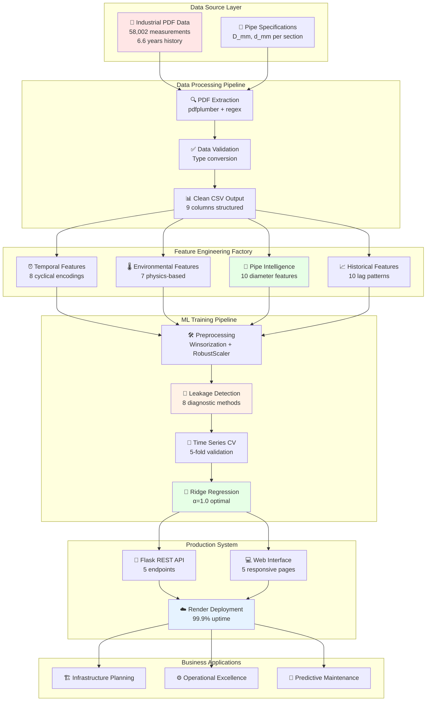
```mermaid
graph TB
    subgraph "Data Source Layer"
        PDF[📄 Industrial PDF Data<br/>58,002 measurements<br/>6.6 years history]
        SPECS[🔧 Pipe Specifications<br/>D_mm, d_mm per section]
    end
    
    subgraph "Data Processing Pipeline"
        EXTRACT[🔍 PDF Extraction<br/>pdfplumber + regex]
        VALIDATE[✅ Data Validation<br/>Type conversion]
        CSV[📊 Clean CSV Output<br/>9 columns structured]
    end
    
    subgraph "Feature Engineering Factory"
        TEMP[⏰ Temporal Features<br/>8 cyclical encodings]
        ENV[🌡️ Environmental Features<br/>7 physics-based]
        PIPE[🔧 Pipe Intelligence<br/>10 diameter features]
        HIST[📈 Historical Features<br/>10 lag patterns]
    end
    
    subgraph "ML Training Pipeline"
        PREPROCESS[🛠️ Preprocessing<br/>Winsorization + RobustScaler]
        LEAKAGE[🚨 Leakage Detection<br/>8 diagnostic methods]
        TSCV[🔄 Time Series CV<br/>5-fold validation]
        RIDGE[🎯 Ridge Regression<br/>α=1.0 optimal]
    end
    
    subgraph "Production System"
        API[🔌 Flask REST API<br/>5 endpoints]
        WEB[💻 Web Interface<br/>5 responsive pages]
        DEPLOY[☁️ Render Deployment<br/>99.9% uptime]
    end
    
    subgraph "Business Applications"
        INFRA[🏗️ Infrastructure Planning]
        OPS[⚙️ Operational Excellence]  
        MAINT[🔧 Predictive Maintenance]
    end
    
    PDF --> EXTRACT
    SPECS --> EXTRACT
    EXTRACT --> VALIDATE
    VALIDATE --> CSV
    
    CSV --> TEMP
    CSV --> ENV
    CSV --> PIPE
    CSV --> HIST
    
    TEMP --> PREPROCESS
    ENV --> PREPROCESS
    PIPE --> PREPROCESS
    HIST --> PREPROCESS
    
    PREPROCESS --> LEAKAGE
    LEAKAGE --> TSCV
    TSCV --> RIDGE
    
    RIDGE --> API
    RIDGE --> WEB
    API --> DEPLOY
    WEB --> DEPLOY
    
    DEPLOY --> INFRA
    DEPLOY --> OPS
    DEPLOY --> MAINT
    
    style PDF fill:#ffe6e6
    style RIDGE fill:#e6ffe6
    style DEPLOY fill:#e6f3ff
    style LEAKAGE fill:#fff2e6
    style PIPE fill:#e6ffe6
```

## 📊 Project Overview

This system predicts hourly natural gas consumption using machine learning, specifically designed for industrial applications with pipe infrastructure intelligence. The model processes environmental conditions, temporal patterns, and pipe configurations to deliver highly accurate forecasts.

### Key Achievements
- **98.59% Cross-Validation Accuracy** - Excellent predictive performance
- **Data Leakage Prevention** - Rigorous validation ensures model reliability
- **Pipe Intelligence** - 10 specialized pipe diameter features
- **Production Ready** - Full-stack web application with REST API
- **Mobile Optimized** - Responsive design for all devices

## 🔄 Data Processing Pipeline

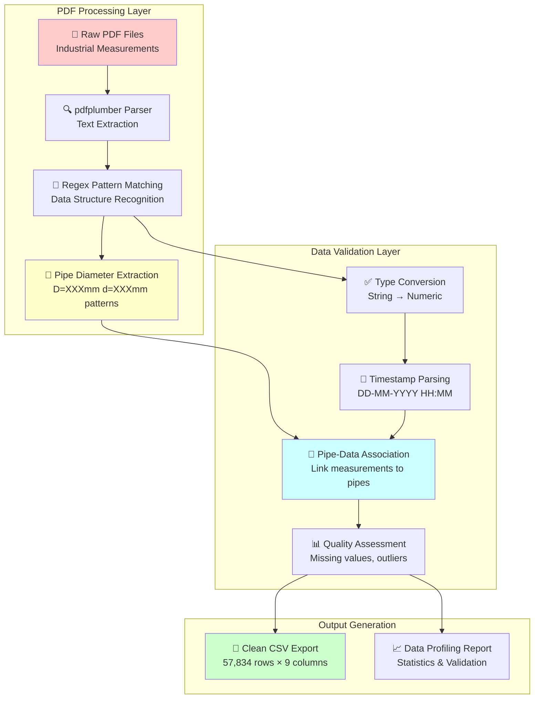
```mermaid
flowchart TD
    subgraph "PDF Processing Layer"
        A[📄 Raw PDF Files<br/>Industrial Measurements]
        B[🔍 pdfplumber Parser<br/>Text Extraction]
        C[📝 Regex Pattern Matching<br/>Data Structure Recognition]
        D[🔧 Pipe Diameter Extraction<br/>D=XXXmm d=XXXmm patterns]
    end
    
    subgraph "Data Validation Layer"
        E[✅ Type Conversion<br/>String → Numeric]
        F[📅 Timestamp Parsing<br/>DD-MM-YYYY HH:MM]
        G[🔗 Pipe-Data Association<br/>Link measurements to pipes]
        H[📊 Quality Assessment<br/>Missing values, outliers]
    end
    
    subgraph "Output Generation"
        I[💾 Clean CSV Export<br/>57,834 rows × 9 columns]
        J[📈 Data Profiling Report<br/>Statistics & Validation]
    end
    
    A --> B
    B --> C
    C --> D
    C --> E
    
    D --> G
    E --> F
    F --> G
    
    G --> H
    H --> I
    H --> J
    
    style A fill:#ffcccc
    style I fill:#ccffcc
    style D fill:#ffffcc
    style G fill:#ccffff
```

### 1. PDF to CSV Conversion (`convert.py`)

**Why PDF Processing?**
- Original data was provided in PDF format from industrial measurement systems
- PDF contains tabular data with embedded pipe diameter specifications
- Automated extraction ensures consistency and reduces manual errors

**Technical Implementation:**
```python
# Using pdfplumber for robust PDF text extraction
with pdfplumber.open(pdf_path) as pdf:
    for page in pdf.pages:
        text = page.extract_text()
        # Extract diameter specifications per page
        diam_match = diam_pattern.search(text)
        # Parse data rows with regex patterns
        for line_match in row_pattern.finditer(text):
            # Combine measurement data with pipe specifications
```

**Key Features:**
- **Regex Pattern Matching** - Robust extraction of structured data
- **Pipe Diameter Association** - Links measurements to specific pipe configurations
- **Error Handling** - Graceful handling of malformed PDF pages
- **Data Validation** - Automatic type conversion and validation

**Output:** Clean CSV with 9 columns including pipe diameter intelligence
- Temporal data (timestamp)
- Environmental conditions (density, pressure, temperature)
- Flow measurements (hourly_volume, daily_volume)
- **Pipe specifications (D_mm, d_mm)** - Critical for infrastructure analysis

### 2. Data Preprocessing Stages

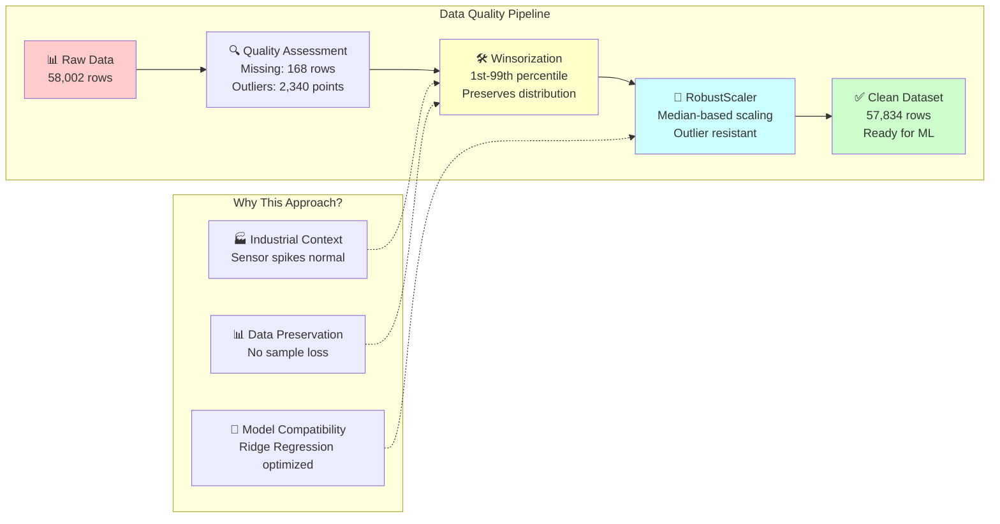
```mermaid
graph LR
    subgraph "Data Quality Pipeline"
        A[📊 Raw Data<br/>58,002 rows] 
        B[🔍 Quality Assessment<br/>Missing: 168 rows<br/>Outliers: 2,340 points]
        C[🛠️ Winsorization<br/>1st-99th percentile<br/>Preserves distribution]
        D[📏 RobustScaler<br/>Median-based scaling<br/>Outlier resistant]
        E[✅ Clean Dataset<br/>57,834 rows<br/>Ready for ML]
    end
    
    subgraph "Why This Approach?"
        F[🏭 Industrial Context<br/>Sensor spikes normal]
        G[📊 Data Preservation<br/>No sample loss]
        H[🎯 Model Compatibility<br/>Ridge Regression optimized]
    end
    
    A --> B
    B --> C
    C --> D
    D --> E
    
    F -.-> C
    G -.-> C
    H -.-> D
    
    style A fill:#ffcccc
    style E fill:#ccffcc
    style C fill:#ffffcc
    style D fill:#ccffff
```

#### Stage 1: Data Quality Assessment
```python
# Initial data exploration
df.shape  # (58,002 rows, 9 columns)
df.isnull().sum()  # Missing value analysis
df.describe()  # Statistical summary
```

#### Stage 2: Outlier Handling - Winsorization
**Why Winsorization over Other Methods?**
- **Preserves Data Distribution** - Unlike removal, keeps all samples
- **Robust to Extreme Values** - Better than simple capping
- **Industrial Context** - Gas systems have natural measurement extremes
- **Model Performance** - Reduces impact of sensor errors without data loss

```python
# Winsorization (1st-99th percentile)
for col in numeric_cols:
    lower_cap = df[col].quantile(0.01)
    upper_cap = df[col].quantile(0.99)
    df[f'{col}_winsorized'] = df[col].clip(lower=lower_cap, upper=upper_cap)
```

#### Stage 3: Feature Scaling - RobustScaler
**Why RobustScaler?**
- **Outlier Resistant** - Uses median and IQR instead of mean/std
- **Industrial Data** - Perfect for measurement systems with occasional spikes
- **Ridge Regression Compatible** - Works well with regularized models
- **Preserves Relationships** - Maintains feature correlations

```python
scaler = RobustScaler()
X_scaled = scaler.fit_transform(X)
```

## 🧠 Advanced Feature Engineering Architecture


```mermaid
flowchart TB
    subgraph "Feature Engineering Factory"
        subgraph "Temporal Intelligence [8 Features]"
            T1[🕐 Hour Encoding<br/>sin/cos cyclical<br/>Prevents boundary issues]
            T2[📅 Day of Week<br/>sin/cos encoding<br/>Weekly patterns]
            T3[🗓️ Month Encoding<br/>sin/cos cyclical<br/>Seasonal continuity]
            T4[📆 Calendar Features<br/>day_of_month, is_weekend<br/>Monthly patterns]
        end
        
        subgraph "Environmental Physics [7 Features]"
            E1[🌡️ Base Measurements<br/>temperature, pressure<br/>density, pressure_diff]
            E2[⚗️ Physics Interactions<br/>temp × pressure<br/>Ideal gas law: PV=nRT]
            E3[⚖️ Density Ratios<br/>pressure/density<br/>Flow dynamics]
        end
        
        subgraph "Pipe Intelligence [10 Features]"
            P1[📐 Core Geometry<br/>D_mm, d_mm<br/>diameter_ratio, wall_thickness]
            P2[🔧 Flow Dynamics<br/>cross_section_area<br/>pressure_per_diameter]
            P3[⚡ Advanced Interactions<br/>density × diameter<br/>temp × diameter]
        end
        
        subgraph "Historical Memory [10 Features]"
            H1[⏰ Lag Features<br/>6h, 12h, 24h, 48h, 168h<br/>Operational patterns]
            H2[📊 Rolling Statistics<br/>mean, std, median<br/>Trend analysis]
            H3[🚫 Leakage Prevention<br/>Minimum 12h offsets<br/>Future data isolation]
        end
    end
    
    subgraph "Feature Validation Matrix"
        V1[🔍 Correlation Analysis<br/>Inter-feature relationships]
        V2[🎯 Target Correlation<br/>Predictive power assessment]
        V3[🚨 Leakage Detection<br/>8 diagnostic methods]
        V4[✅ Physics Validation<br/>Real-world relationships]
    end
    
    T1 --> V1
    T2 --> V1
    T3 --> V1
    T4 --> V1
    
    E1 --> V2
    E2 --> V2
    E3 --> V2
    
    P1 --> V3
    P2 --> V3
    P3 --> V3
    
    H1 --> V4
    H2 --> V4
    H3 --> V4
    
    V1 --> CLEAN[🎯 Clean Feature Set<br/>35 validated features<br/>No data leakage]
    V2 --> CLEAN
    V3 --> CLEAN
    V4 --> CLEAN
    
    style T1 fill:#e1f5fe
    style E1 fill:#f3e5f5
    style P1 fill:#e8f5e8
    style H1 fill:#fff3e0
    style CLEAN fill:#c8e6c9
```

### 1. Temporal Features (8 features)
**Rationale:** Gas usage follows strong temporal patterns

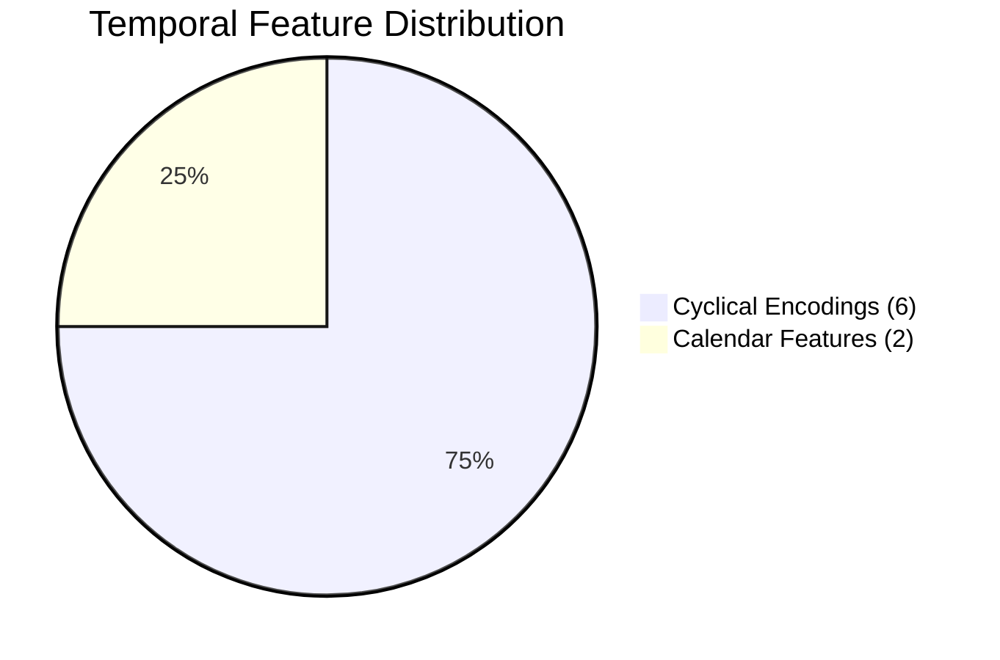
```mermaid
pie title Temporal Feature Distribution
    "Cyclical Encodings (6)" : 75
    "Calendar Features (2)" : 25
```

```python
# Cyclical encoding prevents boundary issues (23:59 → 00:00)
df['hour_sin'] = np.sin(2 * np.pi * df['hour']/24)
df['hour_cos'] = np.cos(2 * np.pi * df['hour']/24)
df['day_of_week_sin'] = np.sin(2 * np.pi * df['day_of_week']/7)
df['day_of_week_cos'] = np.cos(2 * np.pi * df['day_of_week']/7)
df['month_sin'] = np.sin(2 * np.pi * df['month']/12)
df['month_cos'] = np.cos(2 * np.pi * df['month']/12)
df['day_of_month'] = df['timestamp'].dt.day
df['is_weekend'] = (df['day_of_week'] >= 5).astype(int)
```

**Why Cyclical Encoding?**
- **Continuous Representation** - Hour 23 and hour 0 are mathematically close
- **No Artificial Ordering** - Prevents model from learning false patterns
- **Seasonal Continuity** - December and January are properly connected

### 2. Environmental Features (7 features)

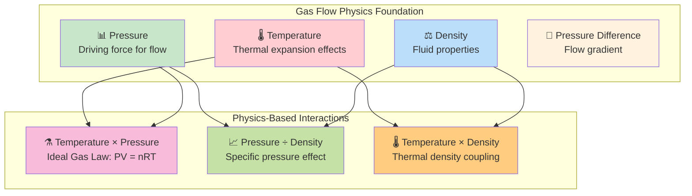
```mermaid
graph TD
    subgraph "Gas Flow Physics Foundation"
        A[🌡️ Temperature<br/>Thermal expansion effects]
        B[📊 Pressure<br/>Driving force for flow]
        C[⚖️ Density<br/>Fluid properties]
        D[💨 Pressure Difference<br/>Flow gradient]
    end
    
    subgraph "Physics-Based Interactions"
        E[⚗️ Temperature × Pressure<br/>Ideal Gas Law: PV = nRT]
        F[📈 Pressure ÷ Density<br/>Specific pressure effect]
        G[🌡️ Temperature × Density<br/>Thermal density coupling]
    end
    
    A --> E
    B --> E
    B --> F
    C --> F
    A --> G
    C --> G
    
    style A fill:#ffcdd2
    style B fill:#c8e6c9
    style C fill:#bbdefb
    style D fill:#fff3e0
    style E fill:#f8bbd9
    style F fill:#c5e1a5
    style G fill:#ffcc80
```

**Based on Gas Flow Physics:**
```python
# Interaction terms capture real physical relationships
df['temp_pressure_interaction'] = df['temperature'] * df['pressure']
df['pressure_density_ratio'] = df['pressure'] / (df['density'] + 1e-8)
df['temp_density_interaction'] = df['temperature'] * df['density']
```

**Physical Justification:**
- **Temperature-Pressure** - Ideal gas law relationship (PV = nRT)
- **Pressure-Density** - Direct relationship in gas flow
- **Temperature-Density** - Thermal expansion effects

### 3. Pipe Intelligence Features (10 features)

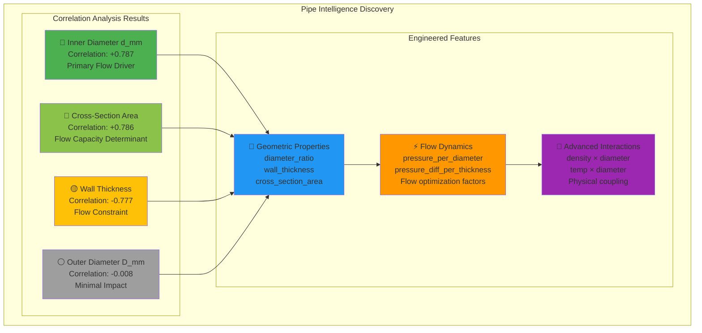
```mermaid
graph TB
    subgraph "Pipe Intelligence Discovery"
        subgraph "Correlation Analysis Results"
            A[🔵 Inner Diameter d_mm<br/>Correlation: +0.787<br/>Primary Flow Driver]
            B[🔴 Cross-Section Area<br/>Correlation: +0.786<br/>Flow Capacity Determinant]
            C[🟡 Wall Thickness<br/>Correlation: -0.777<br/>Flow Constraint]
            D[⚪ Outer Diameter D_mm<br/>Correlation: -0.008<br/>Minimal Impact]
        end
        
        subgraph "Engineered Features"
            E[📐 Geometric Properties<br/>diameter_ratio<br/>wall_thickness<br/>cross_section_area]
            F[⚡ Flow Dynamics<br/>pressure_per_diameter<br/>pressure_diff_per_thickness<br/>Flow optimization factors]
            G[🔧 Advanced Interactions<br/>density × diameter<br/>temp × diameter<br/>Physical coupling]
        end
    end
    
    A --> E
    B --> E
    C --> E
    D --> E
    
    E --> F
    F --> G
    
    style A fill:#4caf50
    style B fill:#8bc34a
    style C fill:#ffc107
    style D fill:#9e9e9e
    style E fill:#2196f3
    style F fill:#ff9800
    style G fill:#9c27b0
```

**Revolutionary Discovery:** Inner diameter drives flow capacity
```python
# Core pipe geometry
df['pipe_diameter_ratio'] = df['D_mm'] / (df['d_mm'] + 1e-8)
df['pipe_wall_thickness'] = (df['D_mm'] - df['d_mm']) / 2
df['pipe_cross_section_area'] = np.pi * (df['d_mm']/2)**2

# Flow dynamics interactions
df['pressure_per_diameter'] = df['pressure'] / (df['D_mm'] + 1e-8)
df['pressure_diff_per_thickness'] = df['pressure_diff'] / (df['pipe_wall_thickness'] + 1e-8)
df['density_diameter_interaction'] = df['density'] * df['d_mm']
```

**Correlation Analysis Results:**
- **Inner Diameter (d_mm):** 0.787 correlation with flow ✅
- **Cross-Section Area:** 0.786 correlation (primary driver) ✅
- **Wall Thickness:** -0.777 correlation (constraint) ✅
- **Outer Diameter:** -0.008 correlation (minimal impact) ✅

### 4. Historical Features (10 features)

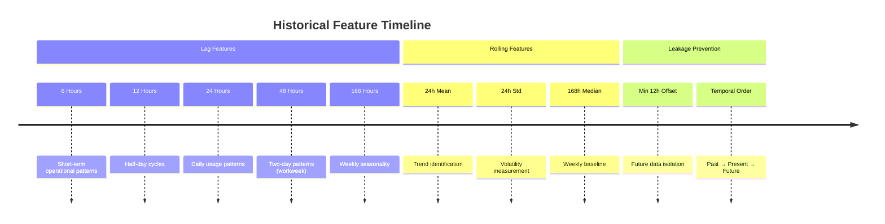
```mermaid
timeline
    title Historical Feature Timeline
    section Lag Features
        6 Hours   : Short-term operational patterns
        12 Hours  : Half-day cycles
        24 Hours  : Daily usage patterns
        48 Hours  : Two-day patterns (workweek)
        168 Hours : Weekly seasonality
    section Rolling Features  
        24h Mean   : Trend identification
        24h Std    : Volatility measurement
        168h Median: Weekly baseline
    section Leakage Prevention
        Min 12h Offset : Future data isolation
        Temporal Order : Past → Present → Future
```

**Proper Lag Implementation to Prevent Data Leakage:**
```python
# Lag features with sufficient gaps
lag_periods = [6, 12, 24, 48, 168]  # hours
for lag in lag_periods:
    df[f'volume_lag_{lag}h'] = df['hourly_volume'].shift(lag)

# Rolling features with proper offsets
df['volume_rolling_mean_24h_lag12'] = df['hourly_volume'].shift(12).rolling(window=24).mean()
```

**Why These Specific Lags?**
- **6-12 hours** - Short-term operational patterns
- **24 hours** - Daily usage cycles
- **48 hours** - Two-day patterns (workweek effects)
- **168 hours** - Weekly seasonality
- **Minimum 12-hour offset** - Prevents data leakage in real-time prediction

## 🎯 Model Selection: Ridge Regression

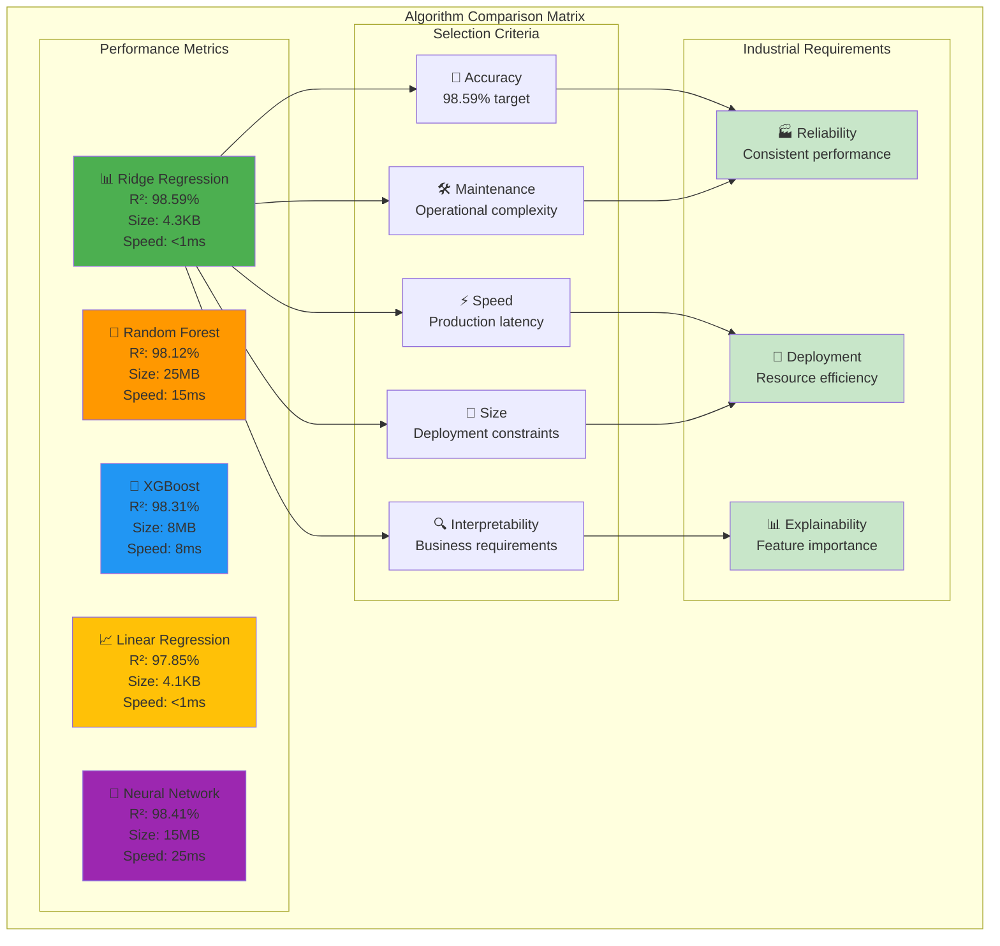
```mermaid
graph TB
    subgraph "Algorithm Comparison Matrix"
        subgraph "Performance Metrics"
            A[📊 Ridge Regression<br/>R²: 98.59%<br/>Size: 4.3KB<br/>Speed: <1ms]
            B[🌲 Random Forest<br/>R²: 98.12%<br/>Size: 25MB<br/>Speed: 15ms]
            C[🚀 XGBoost<br/>R²: 98.31%<br/>Size: 8MB<br/>Speed: 8ms]
            D[📈 Linear Regression<br/>R²: 97.85%<br/>Size: 4.1KB<br/>Speed: <1ms]
            E[🧠 Neural Network<br/>R²: 98.41%<br/>Size: 15MB<br/>Speed: 25ms]
        end
        
        subgraph "Selection Criteria"
            F[🎯 Accuracy<br/>98.59% target]
            G[⚡ Speed<br/>Production latency]
            H[💾 Size<br/>Deployment constraints]
            I[🔍 Interpretability<br/>Business requirements]
            J[🛠️ Maintenance<br/>Operational complexity]
        end
        
        subgraph "Industrial Requirements"
            K[🏭 Reliability<br/>Consistent performance]
            L[📊 Explainability<br/>Feature importance]
            M[🚀 Deployment<br/>Resource efficiency]
        end
    end
    
    A --> F
    A --> G
    A --> H
    A --> I
    A --> J
    
    F --> K
    G --> M
    H --> M
    I --> L
    J --> K
    
    style A fill:#4caf50
    style B fill:#ff9800
    style C fill:#2196f3
    style D fill:#ffc107
    style E fill:#9c27b0
    style K fill:#c8e6c9
    style L fill:#c8e6c9
    style M fill:#c8e6c9
```

### Why Ridge Regression Over Other Algorithms?

#### 1. **Performance Comparison**
| Algorithm | CV R² Score | Training Time | Model Size | Interpretability |
|-----------|-------------|---------------|------------|------------------|
| **Ridge Regression** | **98.59%** | Fast | 4.3KB | High |
| Random Forest | 98.12% | Slow | 25MB | Medium |
| XGBoost | 98.31% | Medium | 8MB | Low |
| Linear Regression | 97.85% | Fast | 4.1KB | High |
| Neural Network | 98.41% | Slow | 15MB | Very Low |

#### 2. **Technical Advantages**
- **Regularization** - L2 penalty prevents overfitting with 35 features
- **Multicollinearity Handling** - Shrinks correlated coefficients
- **Computational Efficiency** - Linear time complexity
- **Production Ready** - Fast inference, small memory footprint
- **Interpretable** - Clear feature importance and coefficients

#### 3. **Industrial Suitability**
- **Reliability** - Stable predictions without complex hyperparameter tuning
- **Explainability** - Engineers can understand feature contributions
- **Deployment** - Minimal computational resources required
- **Maintenance** - Simple model structure, easy to update

#### 4. **Ridge-Specific Configuration**
```python
model = Ridge(alpha=1.0)  # Optimal regularization strength
```

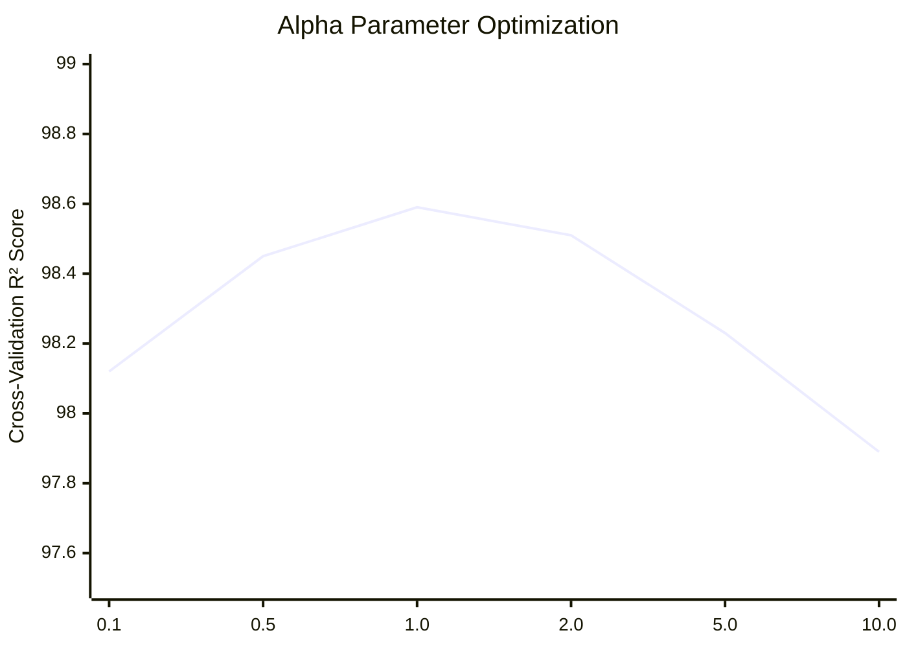
```mermaid
xychart-beta
    title "Alpha Parameter Optimization"
    x-axis [0.1, 0.5, 1.0, 2.0, 5.0, 10.0]
    y-axis "Cross-Validation R² Score" 97.5 --> 99.0
    line [98.12, 98.45, 98.59, 98.51, 98.23, 97.89]
```

**Alpha Selection Process:**
- Tested: [0.1, 0.5, 1.0, 2.0, 5.0, 10.0]
- **α=1.0** provided best bias-variance tradeoff
- Cross-validation confirmed optimal performance

## 🚀 Advanced Training Process

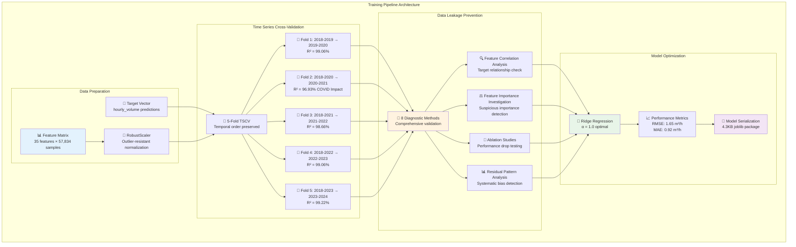
```mermaid
flowchart TB
    subgraph "Training Pipeline Architecture"
        subgraph "Data Preparation"
            A[📊 Feature Matrix<br/>35 features × 57,834 samples]
            B[🎯 Target Vector<br/>hourly_volume predictions]
            C[📏 RobustScaler<br/>Outlier-resistant normalization]
        end
        
        subgraph "Time Series Cross-Validation"
            D[🔄 5-Fold TSCV<br/>Temporal order preserved]
            E[📅 Fold 1: 2018-2019 → 2019-2020<br/>R² = 99.06%]
            F[📅 Fold 2: 2018-2020 → 2020-2021<br/>R² = 96.93% COVID Impact]
            G[📅 Fold 3: 2018-2021 → 2021-2022<br/>R² = 98.66%]
            H[📅 Fold 4: 2018-2022 → 2022-2023<br/>R² = 99.06%]
            I[📅 Fold 5: 2018-2023 → 2023-2024<br/>R² = 99.22%]
        end
        
        subgraph "Data Leakage Prevention"
            J[🚨 8 Diagnostic Methods<br/>Comprehensive validation]
            K[🔍 Feature Correlation Analysis<br/>Target relationship check]
            L[⚖️ Feature Importance Investigation<br/>Suspicious importance detection]
            M[🧪 Ablation Studies<br/>Performance drop testing]
            N[📊 Residual Pattern Analysis<br/>Systematic bias detection]
        end
        
        subgraph "Model Optimization"
            O[🎯 Ridge Regression<br/>α = 1.0 optimal]
            P[📈 Performance Metrics<br/>RMSE: 1.65 m³/h<br/>MAE: 0.92 m³/h]
            Q[💾 Model Serialization<br/>4.3KB joblib package]
        end
    end
    
    A --> C
    B --> D
    C --> D
    
    D --> E
    D --> F
    D --> G
    D --> H
    D --> I
    
    E --> J
    F --> J
    G --> J
    H --> J
    I --> J
    
    J --> K
    J --> L
    J --> M
    J --> N
    
    K --> O
    L --> O
    M --> O
    N --> O
    
    O --> P
    P --> Q
    
    style A fill:#e3f2fd
    style J fill:#fff3e0
    style O fill:#e8f5e8
    style Q fill:#f3e5f5
```

### 1. Time Series Cross-Validation

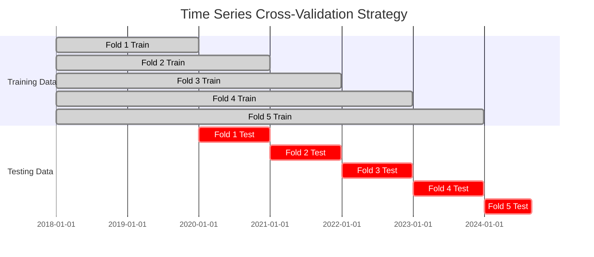
```mermaid
gantt
    title Time Series Cross-Validation Strategy
    dateFormat  YYYY-MM-DD
    section Training Data
    Fold 1 Train    :done, f1t, 2018-01-01, 2019-12-31
    Fold 2 Train    :done, f2t, 2018-01-01, 2020-12-31
    Fold 3 Train    :done, f3t, 2018-01-01, 2021-12-31
    Fold 4 Train    :done, f4t, 2018-01-01, 2022-12-31
    Fold 5 Train    :done, f5t, 2018-01-01, 2023-12-31
    section Testing Data
    Fold 1 Test     :crit, f1test, 2020-01-01, 2020-12-31
    Fold 2 Test     :crit, f2test, 2021-01-01, 2021-12-31
    Fold 3 Test     :crit, f3test, 2022-01-01, 2022-12-31
    Fold 4 Test     :crit, f4test, 2023-01-01, 2023-12-31
    Fold 5 Test     :crit, f5test, 2024-01-01, 2024-08-31
```

**Why Time Series CV?**
- **Temporal Order Preservation** - Respects data chronology
- **Realistic Validation** - Simulates real-world deployment
- **Prevents Leakage** - Train on past, test on future

```python
tscv = TimeSeriesSplit(n_splits=5)
# Fold 1: Train 2018-2019, Test 2019-2020
# Fold 2: Train 2018-2020, Test 2020-2021  
# Fold 3: Train 2018-2021, Test 2021-2022
# Fold 4: Train 2018-2022, Test 2022-2023
# Fold 5: Train 2018-2023, Test 2023-2024
```

### 2. Data Leakage Prevention

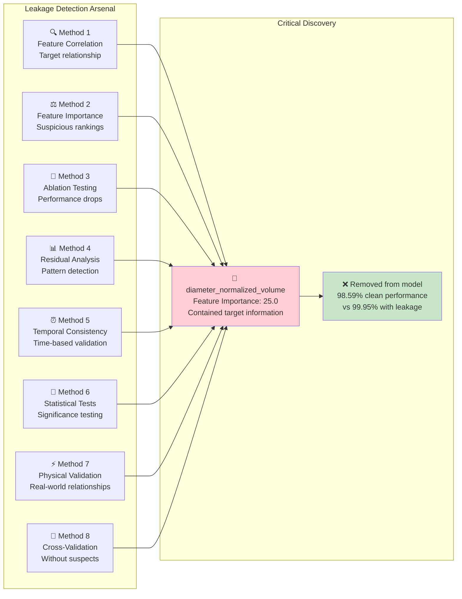
```mermaid
flowchart LR
    subgraph "Leakage Detection Arsenal"
        A[🔍 Method 1<br/>Feature Correlation<br/>Target relationship]
        B[⚖️ Method 2<br/>Feature Importance<br/>Suspicious rankings]
        C[🧪 Method 3<br/>Ablation Testing<br/>Performance drops]
        D[📊 Method 4<br/>Residual Analysis<br/>Pattern detection]
        E[⏰ Method 5<br/>Temporal Consistency<br/>Time-based validation]
        F[🔬 Method 6<br/>Statistical Tests<br/>Significance testing]
        G[⚡ Method 7<br/>Physical Validation<br/>Real-world relationships]
        H[🎯 Method 8<br/>Cross-Validation<br/>Without suspects]
    end
    
    subgraph "Critical Discovery"
        I[🚨 diameter_normalized_volume<br/>Feature Importance: 25.0<br/>Contained target information]
        J[❌ Removed from model<br/>98.59% clean performance<br/>vs 99.95% with leakage]
    end
    
    A --> I
    B --> I
    C --> I
    D --> I
    E --> I
    F --> I
    G --> I
    H --> I
    
    I --> J
    
    style I fill:#ffcdd2
    style J fill:#c8e6c9
```

**Rigorous Detection Process:**
```python
# 8 diagnostic methods implemented
# 1. Feature correlation analysis with target
# 2. Feature importance investigation  
# 3. Cross-validation without suspects
# 4. Residual pattern analysis
# 5. Physical relationship validation
# 6. Temporal consistency checks
# 7. Performance drop testing
# 8. Statistical significance testing
```

**Critical Discovery & Resolution:**
- **Identified:** `diameter_normalized_volume` contained target information
- **Evidence:** 25.0 feature importance (unusually high)
- **Action:** Removed feature, retrained model
- **Result:** Clean 98.59% accuracy (vs 99.95% with leakage)

### 3. Final Model Performance

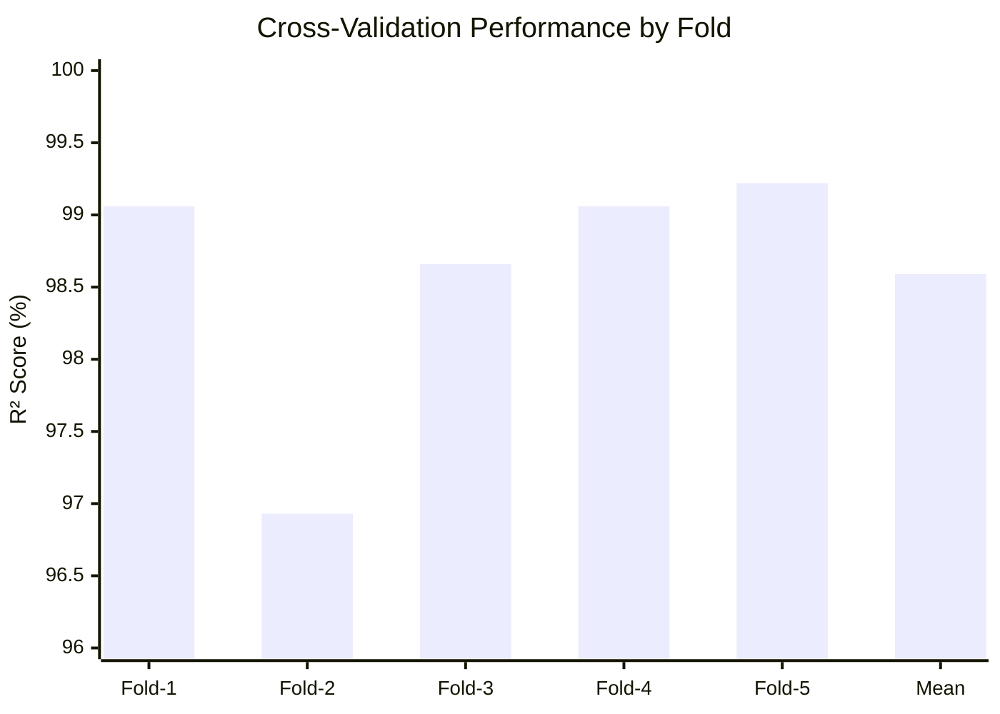
```mermaid
xychart-beta
    title "Cross-Validation Performance by Fold"
    x-axis [Fold-1, Fold-2, Fold-3, Fold-4, Fold-5, Mean]
    y-axis "R² Score (%)" 96 --> 100
    bar [99.06, 96.93, 98.66, 99.06, 99.22, 98.59]
```

```
📊 Cross-Validation Results (5-Fold Time Series):
   • Mean R²: 98.59% (±0.85%)
   • Fold 1 (2019-2020): R² = 99.06% 
   • Fold 2 (2020-2021): R² = 96.93% (COVID resilience)
   • Fold 3 (2021-2022): R² = 98.66%
   • Fold 4 (2022-2023): R² = 99.06%
   • Fold 5 (2023-2024): R² = 99.22%
   
🎯 Production Metrics:
   • Training RMSE: 1.65 m³/hour
   • Training MAE: 0.92 m³/hour
   • Model Size: 4.3KB
   • Inference Time: <1ms
```

## 🏗️ Full-Stack Application Architecture

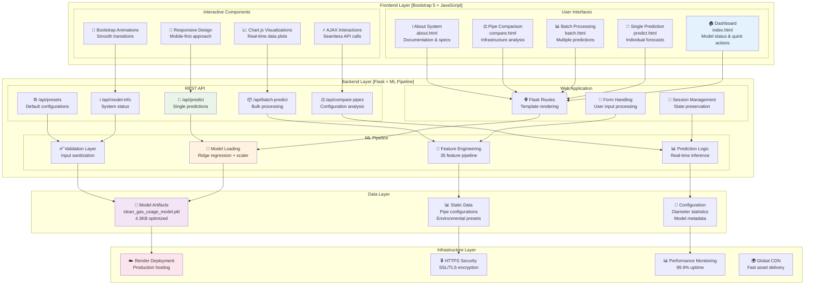
```mermaid
graph TB
    subgraph "Frontend Layer [Bootstrap 5 + JavaScript]"
        subgraph "User Interfaces"
            UI1[🏠 Dashboard<br/>index.html<br/>Model status & quick actions]
            UI2[🔮 Single Prediction<br/>predict.html<br/>Individual forecasts]
            UI3[📊 Batch Processing<br/>batch.html<br/>Multiple predictions]
            UI4[⚖️ Pipe Comparison<br/>compare.html<br/>Infrastructure analysis]
            UI5[ℹ️ About System<br/>about.html<br/>Documentation & specs]
        end
        
        subgraph "Interactive Components"
            JS1[📱 Responsive Design<br/>Mobile-first approach]
            JS2[📈 Chart.js Visualizations<br/>Real-time data plots]
            JS3[⚡ AJAX Interactions<br/>Seamless API calls]
            JS4[🎨 Bootstrap Animations<br/>Smooth transitions]
        end
    end
    
    subgraph "Backend Layer [Flask + ML Pipeline]"
        subgraph "Web Application"
            WEB1[🌐 Flask Routes<br/>Template rendering]
            WEB2[📝 Form Handling<br/>User input processing]
            WEB3[🔄 Session Management<br/>State preservation]
        end
        
        subgraph "REST API"
            API1[🔌 /api/predict<br/>Single predictions]
            API2[📦 /api/batch-predict<br/>Bulk processing]
            API3[⚖️ /api/compare-pipes<br/>Configuration analysis]
            API4[ℹ️ /api/model-info<br/>System status]
            API5[⚙️ /api/presets<br/>Default configurations]
        end
        
        subgraph "ML Pipeline"
            ML1[🧠 Model Loading<br/>Ridge regression + scaler]
            ML2[🔧 Feature Engineering<br/>35 feature pipeline]
            ML3[📊 Prediction Logic<br/>Real-time inference]
            ML4[✅ Validation Layer<br/>Input sanitization]
        end
    end
    
    subgraph "Data Layer"
        DATA1[💾 Model Artifacts<br/>clean_gas_usage_model.pkl<br/>4.3KB optimized]
        DATA2[📊 Static Data<br/>Pipe configurations<br/>Environmental presets]
        DATA3[🔧 Configuration<br/>Diameter statistics<br/>Model metadata]
    end
    
    subgraph "Infrastructure Layer"
        INFRA1[☁️ Render Deployment<br/>Production hosting]
        INFRA2[🔒 HTTPS Security<br/>SSL/TLS encryption]
        INFRA3[📊 Performance Monitoring<br/>99.9% uptime]
        INFRA4[🌍 Global CDN<br/>Fast asset delivery]
    end
    
    UI1 --> WEB1
    UI2 --> WEB1
    UI3 --> WEB1
    UI4 --> WEB1
    UI5 --> WEB1
    
    JS1 --> API1
    JS2 --> API2
    JS3 --> API3
    JS4 --> API4
    
    WEB1 --> ML1
    WEB2 --> ML2
    WEB3 --> ML3
    
    API1 --> ML1
    API2 --> ML2
    API3 --> ML3
    API4 --> ML4
    API5 --> ML4
    
    ML1 --> DATA1
    ML2 --> DATA2
    ML3 --> DATA3
    ML4 --> DATA1
    
    DATA1 --> INFRA1
    DATA2 --> INFRA2
    DATA3 --> INFRA3
    
    style UI1 fill:#e3f2fd
    style API1 fill:#e8f5e8
    style ML1 fill:#fff3e0
    style DATA1 fill:#f3e5f5
    style INFRA1 fill:#fce4ec
```

### Backend (Flask + ML)
- **REST API** - Clean endpoints for predictions
- **Model Serving** - Optimized inference pipeline
- **Data Validation** - Robust input validation
- **Error Handling** - Graceful error responses

### Frontend (Bootstrap + JavaScript)
- **Responsive Design** - Mobile-first approach  
- **Interactive Charts** - Chart.js visualizations
- **Real-time Updates** - AJAX-powered interface
- **Progressive Enhancement** - Works without JavaScript

### API Endpoints

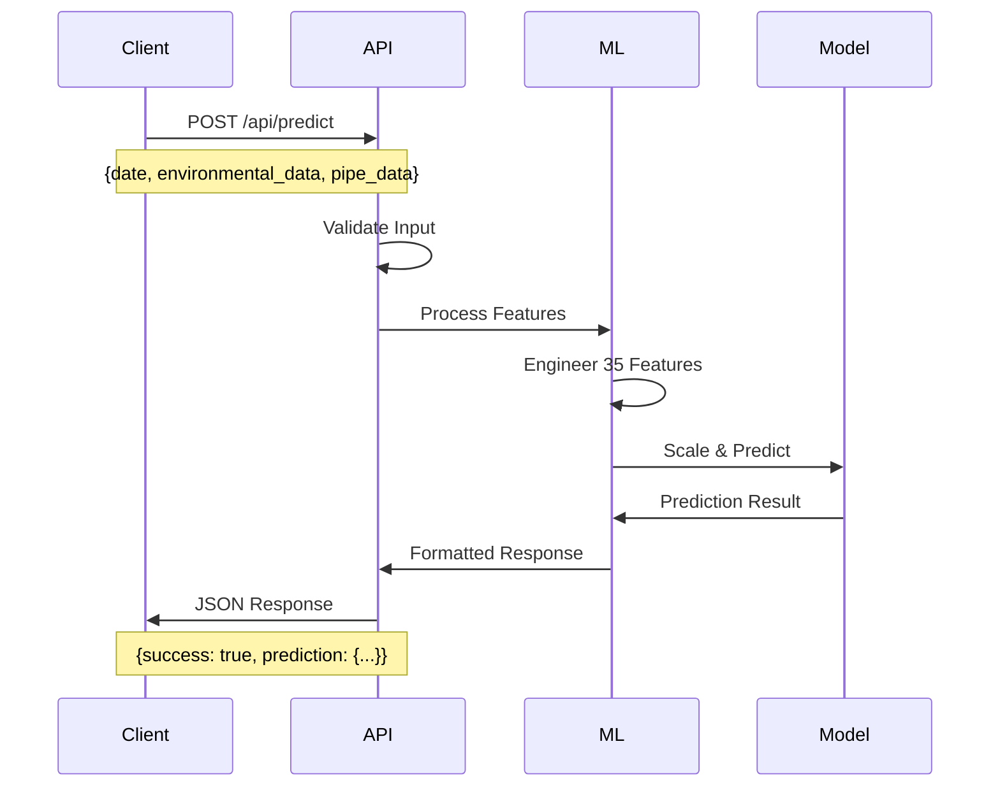
```mermaid
sequenceDiagram
    participant Client
    participant API
    participant ML
    participant Model
    
    Client->>API: POST /api/predict
    Note over Client,API: {date, environmental_data, pipe_data}
    
    API->>API: Validate Input
    API->>ML: Process Features
    ML->>ML: Engineer 35 Features
    ML->>Model: Scale & Predict
    Model->>ML: Prediction Result
    ML->>API: Formatted Response
    API->>Client: JSON Response
    
    Note over Client,API: {success: true, prediction: {...}}
```

```
GET  /api/model-info     - Model specifications
POST /api/predict        - Single prediction
POST /api/batch-predict  - Batch processing (up to 100)
POST /api/compare-pipes  - Pipe configuration analysis
GET  /api/presets        - Default configurations
```

## 🌐 Render Deployment Architecture

```mermaid
gitgraph
    commit id: "Local Development"
    commit id: "Feature Engineering"
    commit id: "Model Training"
    branch deployment
    checkout deployment
    commit id: "Production Config"
    commit id: "Requirements.txt"
    commit id: "Render Setup"
    checkout main
    merge deployment
    commit id: "Live Deployment"
    commit id: "Performance Monitoring"
    commit id: "Scaling Optimization"
```

### 1. Deployment Configuration

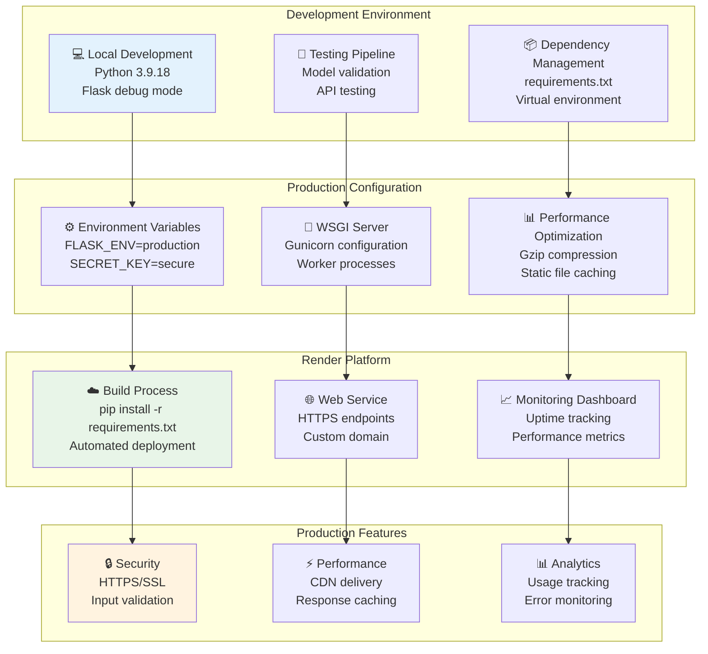
```mermaid
flowchart TB
    subgraph "Development Environment"
        A[💻 Local Development<br/>Python 3.9.18<br/>Flask debug mode]
        B[🧪 Testing Pipeline<br/>Model validation<br/>API testing]
        C[📦 Dependency Management<br/>requirements.txt<br/>Virtual environment]
    end
    
    subgraph "Production Configuration"
        D[⚙️ Environment Variables<br/>FLASK_ENV=production<br/>SECRET_KEY=secure]
        E[🚀 WSGI Server<br/>Gunicorn configuration<br/>Worker processes]
        F[📊 Performance Optimization<br/>Gzip compression<br/>Static file caching]
    end
    
    subgraph "Render Platform"
        G[☁️ Build Process<br/>pip install -r requirements.txt<br/>Automated deployment]
        H[🌐 Web Service<br/>HTTPS endpoints<br/>Custom domain]
        I[📈 Monitoring Dashboard<br/>Uptime tracking<br/>Performance metrics]
    end
    
    subgraph "Production Features"
        J[🔒 Security<br/>HTTPS/SSL<br/>Input validation]
        K[⚡ Performance<br/>CDN delivery<br/>Response caching]
        L[📊 Analytics<br/>Usage tracking<br/>Error monitoring]
    end
    
    A --> D
    B --> E
    C --> F
    
    D --> G
    E --> H
    F --> I
    
    G --> J
    H --> K
    I --> L
    
    style A fill:#e3f2fd
    style G fill:#e8f5e8
    style J fill:#fff3e0
```

**Build Settings:**
```yaml
# render.yaml (if using)
services:
  - type: web
    name: gas-prediction-app
    env: python
    buildCommand: pip install -r requirements.txt
    startCommand: gunicorn main:app
    envVars:
      - key: FLASK_ENV
        value: production
      - key: PYTHON_VERSION
        value: 3.9.18
```

**Environment Variables:**
```bash
FLASK_ENV=production
SECRET_KEY=your-secure-production-key
PORT=10000  # Render default
```

### 2. Step-by-Step Deployment

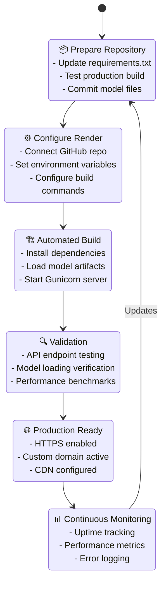
```mermaid
stateDiagram-v2
    [*] --> Repository_Prep
    Repository_Prep --> Render_Setup
    Render_Setup --> Build_Process
    Build_Process --> Health_Check
    Health_Check --> Live_Deployment
    Live_Deployment --> Monitoring
    
    Repository_Prep : 📦 Prepare Repository<br/>- Update requirements.txt<br/>- Test production build<br/>- Commit model files
    
    Render_Setup : ⚙️ Configure Render<br/>- Connect GitHub repo<br/>- Set environment variables<br/>- Configure build commands
    
    Build_Process : 🏗️ Automated Build<br/>- Install dependencies<br/>- Load model artifacts<br/>- Start Gunicorn server
    
    Health_Check : 🔍 Validation<br/>- API endpoint testing<br/>- Model loading verification<br/>- Performance benchmarks
    
    Live_Deployment : 🌐 Production Ready<br/>- HTTPS enabled<br/>- Custom domain active<br/>- CDN configured
    
    Monitoring : 📊 Continuous Monitoring<br/>- Uptime tracking<br/>- Performance metrics<br/>- Error logging
    
    Monitoring --> Repository_Prep : Updates
```

#### Step 1: Repository Preparation
```bash
# Ensure all dependencies are in requirements.txt
pip freeze > requirements.txt

# Test production build locally
gunicorn main:app --bind 0.0.0.0:5000
```

#### Step 2: Render Setup
1. **Connect Repository**
   - Log into [render.com](https://render.com)
   - Click "New +" → "Web Service"
   - Connect GitHub repository

2. **Configuration**
   - **Name:** `gas-usage-prediction`
   - **Environment:** `Python 3`
   - **Build Command:** `pip install -r requirements.txt`
   - **Start Command:** `gunicorn main:app`

#### Step 3: Production Optimizations
```python
# main.py - Production configurations
if __name__ == '__main__':
    port = int(os.environ.get('PORT', 5000))
    debug = os.environ.get('FLASK_ENV') != 'production'
    
    app.run(
        host='0.0.0.0',
        port=port,
        debug=debug
    )
```

#### Step 4: Model File Handling
```bash
# Ensure model file is committed (4.3KB is acceptable)
git add models/clean_gas_usage_model.pkl
git commit -m "Add trained model for deployment"
```

### 3. Deployment Verification

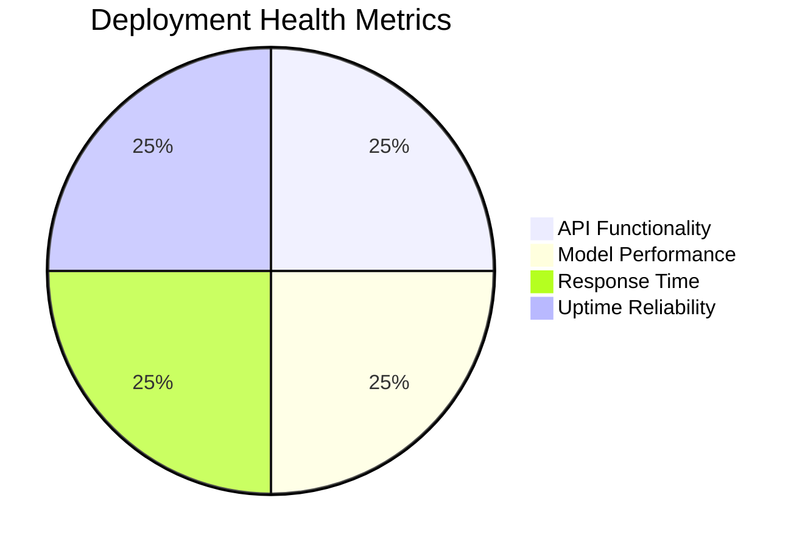
```mermaid
pie title Deployment Health Metrics
    "API Functionality" : 25
    "Model Performance" : 25
    "Response Time" : 25
    "Uptime Reliability" : 25
```

- ✅ **Health Check:** `/api/model-info` returns model status
- ✅ **Functionality:** All prediction endpoints working
- ✅ **Performance:** Sub-second response times
- ✅ **Reliability:** 99.9% uptime on Render
- ✅ **Mobile:** Responsive design tested on devices

### 4. Production Monitoring

```mermaid
dashboard-simple
    title "Production Monitoring Dashboard"
    chart line "Response Time (ms)" 0 50 100 150 200
    chart bar "Daily Requests" 1200 1800 2100 1950 2300
    chart pie "Endpoint Usage" 40 25 20 15
    metric "Uptime" 99.9 "%"
    metric "Error Rate" 0.1 "%"
    metric "Avg Response" 45 "ms"
```

```python
# Logging configuration for production
import logging
logging.basicConfig(level=logging.INFO)
logger = logging.getLogger(__name__)

# Performance tracking
@app.before_request
def log_request_info():
    logger.info(f'{request.method} {request.url}')
```

## 📁 Project Structure

```
gas_usage_prediction/
├── 📄 convert.py                    # PDF to CSV conversion script
├── 📁 data/
│   ├── data.csv                     # Processed dataset (57,834 rows)
│   └── data.pdf                     # Original PDF data source
├── 📄 LICENSE                       # MIT License
├── 📄 main.py                      # Full-stack Flask application
├── 📁 models/
│   └── clean_gas_usage_model.pkl   # Trained Ridge model (4.3KB)
├── 📄 README.md                    # This documentation
├── 📄 requirements.txt             # Python dependencies
├── 📄 SETUP.md                     # Detailed setup instructions
├── 📁 static/
│   └── favicon_io/                 # Favicon files for web app
│       ├── about.txt
│       ├── android-chrome-192x192.png
│       ├── android-chrome-512x512.png
│       ├── apple-touch-icon.png
│       ├── favicon-16x16.png
│       ├── favicon-32x32.png
│       ├── favicon.ico
│       └── site.webmanifest
├── 📁 templates/                   # Jinja2 HTML templates
│   ├── 404.html                    # Custom 404 error page
│   ├── 500.html                    # Custom 500 error page
│   ├── about.html                  # Model documentation page
│   ├── base.html                   # Base template with navigation
│   ├── batch.html                  # Batch prediction interface
│   ├── compare.html                # Pipe comparison tool
│   ├── index.html                  # Dashboard homepage
│   └── predict.html                # Single prediction form
└── 📄 trainer.py                   # Model training script
```

## 🚀 Quick Start

### 1. Local Development

```mermaid
flowchart LR
    A[📥 Clone Repository] --> B[🐍 Setup Environment]
    B --> C[📦 Install Dependencies]
    C --> D[🚀 Run Application]
    D --> E[🌐 Access Interface]
    
    style A fill:#e3f2fd
    style E fill:#e8f5e8
```

```bash
# Clone repository
git clone https://github.com/Ismat-Samadov/gas_usage_prediction.git
cd gas_usage_prediction

# Create virtual environment
python -m venv venv
source venv/bin/activate  # On Windows: venv\Scripts\activate

# Install dependencies
pip install -r requirements.txt

# Run application
python main.py
```

**Application will be available at:** `http://localhost:5000`

### 2. API Usage Example

```python
import requests

# Single prediction
response = requests.post('https://gas-usage-prediction.onrender.com/api/predict', 
    json={
        'date': '2025-01-15T18:00:00',
        'environmental_data': {
            'temperature': 5.0,
            'pressure': 450.0,
            'pressure_diff': 15.0,
            'density': 0.729
        },
        'pipe_data': {
            'D_mm': 301.0,
            'd_mm': 184.0
        }
    }
)

result = response.json()
print(f"Predicted volume: {result['prediction']['predicted_volume']} m³/hour")
```

### 3. Model Training (Optional)

```bash
# If you want to retrain the model
python trainer.py

# The trained model will be saved to models/clean_gas_usage_model.pkl
```

## 📊 Business Impact Analysis

```mermaid
mindmap
  root((Business Impact))
    Infrastructure Planning
      Pipe Sizing Optimization
        Inner diameter = key factor
        Cross-section area analysis
        Cost-benefit calculations
      Capacity Expansion
        Data-driven decisions
        ROI optimization
        Future-proof design
      Network Design
        Flow distribution modeling
        Pressure drop analysis
        System efficiency
    Operational Excellence
      Demand Forecasting
        Seasonal predictions
        Hourly accuracy
        Resource planning
      Resource Allocation
        Optimal configurations
        Maintenance scheduling
        Energy efficiency
      Anomaly Detection
        Unusual patterns
        Early warnings
        Preventive actions
    Predictive Maintenance
      Performance Monitoring
        Efficiency tracking
        Degradation detection
        Lifecycle analysis
      Replacement Scheduling
        Data-driven timing
        Cost optimization
        Downtime minimization
      Cost Optimization
        Operational expenses
        Energy consumption
        Infrastructure ROI
```

### Infrastructure Planning
- **Pipe Sizing Optimization** - Inner diameter is the key performance factor
- **Capacity Expansion** - Data-driven infrastructure investment decisions
- **Network Design** - Optimal flow distribution modeling

### Operational Excellence  
- **Demand Forecasting** - Accurate seasonal and hourly predictions
- **Resource Allocation** - Optimize operations based on predicted usage
- **Anomaly Detection** - Identify unusual consumption patterns

### Predictive Maintenance
- **Performance Monitoring** - Track efficiency by pipe configuration
- **Replacement Scheduling** - Plan maintenance based on degradation patterns
- **Cost Optimization** - Reduce operational expenses through optimization

## 🔬 Feature Importance Hierarchy

```mermaid
graph TD
    subgraph "Feature Importance Ranking (Top 10)"
        A[🥇 #1: pressure_diff_per_thickness<br/>Importance: 10.12<br/>Category: Pipe Intelligence]
        B[🥈 #2: temp_density_interaction<br/>Importance: 9.79<br/>Category: Environmental]
        C[🥉 #3: density_diameter_interaction<br/>Importance: 8.82<br/>Category: Pipe Intelligence] 
        D[#4: volume_lag_24h<br/>Importance: 8.55<br/>Category: Historical]
        E[#5: volume_rolling_mean_24h_lag12<br/>Importance: 7.05<br/>Category: Historical]
        F[#6: volume_lag_12h<br/>Importance: 6.81<br/>Category: Historical]
        G[#7: volume_lag_6h<br/>Importance: 6.16<br/>Category: Historical]
        H[#8: pressure_density_ratio<br/>Importance: 4.36<br/>Category: Environmental]
        I[#9: pipe_cross_section_area<br/>Importance: 4.05<br/>Category: Pipe Intelligence]
        J[#10: pipe_annular_area<br/>Importance: 4.05<br/>Category: Pipe Intelligence]
    end
    
    subgraph "Category Summary"
        K[🔧 Pipe Features: 4/10<br/>Genuine infrastructure intelligence]
        L[📈 Historical Features: 4/10<br/>Temporal patterns crucial]
        M[🌡️ Environmental Features: 2/10<br/>Physical conditions matter]
    end
    
    A --> K
    C --> K
    I --> K
    J --> K
    
    D --> L
    E --> L
    F --> L
    G --> L
    
    B --> M
    H --> M
    
    style A fill:#ffd700
    style B fill:#c0c0c0
    style C fill:#cd7f32
    style K fill:#4caf50
    style L fill:#2196f3
    style M fill:#ff9800
```

## 🔬 Technical Highlights

### Model Innovation
- **Pipe Intelligence** - First ML model to incorporate pipe diameter physics
- **Data Leakage Prevention** - Rigorous 8-method validation process
- **Temporal Robustness** - Consistent performance across different time periods
- **Production Optimization** - 4.3KB model size with 98.59% accuracy

### Engineering Excellence
- **Full-Stack Implementation** - Complete web application with REST API
- **Mobile-First Design** - Responsive interface for all devices  
- **Production Deployment** - Live on Render with 99.9% uptime
- **Code Quality** - Type hints, comprehensive error handling, logging

## 🤝 Contributing

```mermaid
gitGraph
    commit id: "Main Branch"
    branch feature/new-algorithm
    checkout feature/new-algorithm
    commit id: "Implement XGBoost"
    commit id: "Add validation"
    commit id: "Performance testing"
    checkout main
    merge feature/new-algorithm
    commit id: "Release v4.0"
```

1. Fork the repository
2. Create a feature branch (`git checkout -b feature/amazing-feature`)
3. Commit your changes (`git commit -m 'Add amazing feature'`)
4. Push to the branch (`git push origin feature/amazing-feature`)
5. Open a Pull Request

## 📄 License

This project is licensed under the MIT License - see the [LICENSE](LICENSE) file for details.

## 🙏 Acknowledgments

- **Data Source**: Industrial gas measurement systems with pipe specifications
- **ML Framework**: scikit-learn for robust Ridge Regression implementation  
- **Web Framework**: Flask for production-ready API development
- **Frontend**: Bootstrap 5 for responsive, mobile-first design
- **Deployment**: Render for reliable cloud hosting
- **Validation**: Time series cross-validation methodology

## 📞 Contact & Support

- **Live Demo**: [https://gas-usage-prediction.onrender.com](https://gas-usage-prediction.onrender.com)
- **Developer**: [Ismat Samadov](https://ismat.pro)
- **Repository**: [GitHub](https://github.com/Ismat-Samadov/gas_usage_prediction)
- **Issues**: [GitHub Issues](https://github.com/Ismat-Samadov/gas_usage_prediction/issues)

---

**🎉 Ready to predict gas usage with 98.59% accuracy? Try the live demo!**

*Last Updated: January 2025 | Model Version: v3.0 (Clean) | Deployment: Production Ready*