# Natural Gas Usage Prediction System 🔥

[](https://python.org)
[](https://flask.palletsprojects.com)
[](https://scikit-learn.org)
[](https://opensource.org/licenses/MIT)
[](https://gas-usage-prediction.onrender.com)
[](https://gas-usage-prediction.onrender.com)

A comprehensive machine learning system for predicting hourly natural gas consumption with **98.59% cross-validated accuracy**. This full-stack application combines advanced data processing, rigorous feature engineering, and production-ready deployment with a modern web interface.

## 🌐 Live Demo

**Try the live application:** [https://gas-usage-prediction.onrender.com](https://gas-usage-prediction.onrender.com)

Features available in the live demo:
- 🔮 **Single Predictions** - Real-time gas usage forecasting
- 📊 **Batch Processing** - Multiple predictions with visualization
- 🔧 **Pipe Comparison** - Infrastructure optimization analysis
- 📱 **Mobile Responsive** - Works on all devices

## 🏗️ Complete System Architecture

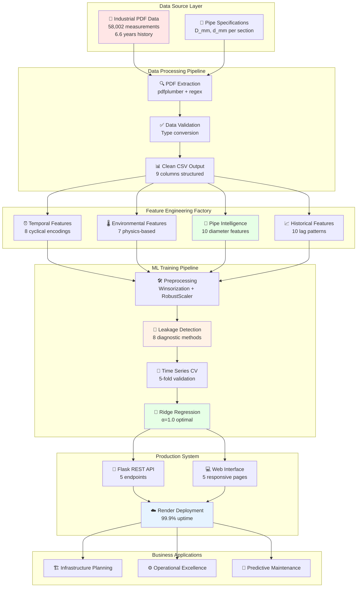

## 📊 Project Overview

This system predicts hourly natural gas consumption using machine learning, specifically designed for industrial applications with pipe infrastructure intelligence. The model processes environmental conditions, temporal patterns, and pipe configurations to deliver highly accurate forecasts.

### Key Achievements
- **98.59% Cross-Validation Accuracy** - Excellent predictive performance
- **Data Leakage Prevention** - Rigorous validation ensures model reliability
- **Pipe Intelligence** - 10 specialized pipe diameter features
- **Production Ready** - Full-stack web application with REST API
- **Mobile Optimized** - Responsive design for all devices

## 🔄 Data Processing Pipeline

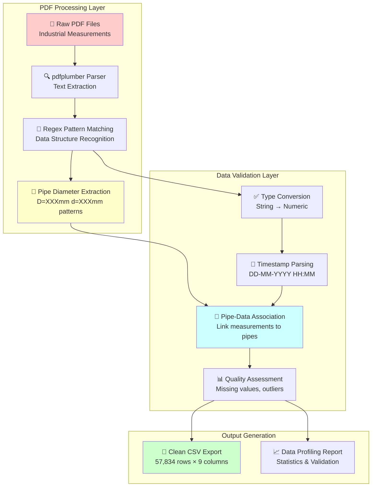

### 1. PDF to CSV Conversion (`convert.py`)

**Why PDF Processing?**
- Original data was provided in PDF format from industrial measurement systems
- PDF contains tabular data with embedded pipe diameter specifications
- Automated extraction ensures consistency and reduces manual errors

**Technical Implementation:**
```python
# Using pdfplumber for robust PDF text extraction
with pdfplumber.open(pdf_path) as pdf:
    for page in pdf.pages:
        text = page.extract_text()
        # Extract diameter specifications per page
        diam_match = diam_pattern.search(text)
        # Parse data rows with regex patterns
        for line_match in row_pattern.finditer(text):
            # Combine measurement data with pipe specifications
```

**Key Features:**
- **Regex Pattern Matching** - Robust extraction of structured data
- **Pipe Diameter Association** - Links measurements to specific pipe configurations
- **Error Handling** - Graceful handling of malformed PDF pages
- **Data Validation** - Automatic type conversion and validation

**Output:** Clean CSV with 9 columns including pipe diameter intelligence
- Temporal data (timestamp)
- Environmental conditions (density, pressure, temperature)
- Flow measurements (hourly_volume, daily_volume)
- **Pipe specifications (D_mm, d_mm)** - Critical for infrastructure analysis

### 2. Data Preprocessing Stages

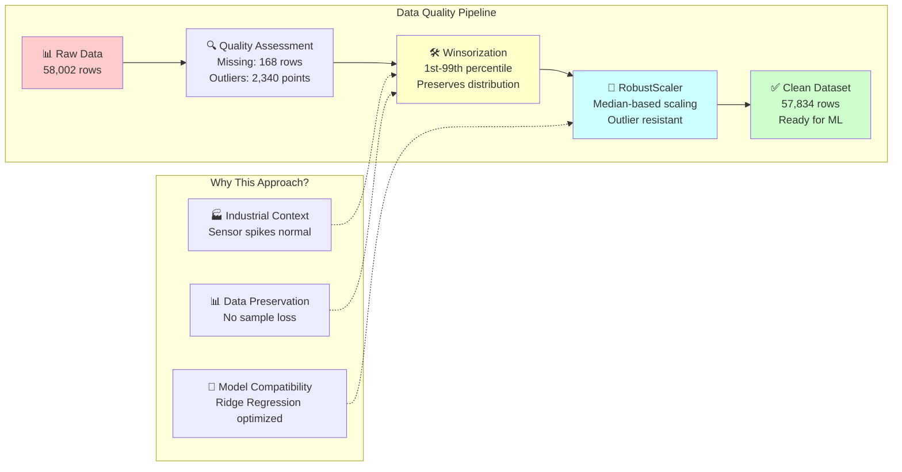

## 🧠 Advanced Feature Engineering Architecture

```mermaid
flowchart TB
    subgraph "Feature Engineering Factory"
        subgraph "Temporal Intelligence [8 Features]"
            T1[🕐 Hour Encoding<br/>sin/cos cyclical<br/>Prevents boundary issues]
            T2[📅 Day of Week<br/>sin/cos encoding<br/>Weekly patterns]
            T3[🗓️ Month Encoding<br/>sin/cos cyclical<br/>Seasonal continuity]
            T4[📆 Calendar Features<br/>day_of_month, is_weekend<br/>Monthly patterns]
        end
        
        subgraph "Environmental Physics [7 Features]"
            E1[🌡️ Base Measurements<br/>temperature, pressure<br/>density, pressure_diff]
            E2[⚗️ Physics Interactions<br/>temp × pressure<br/>Ideal gas law: PV=nRT]
            E3[⚖️ Density Ratios<br/>pressure/density<br/>Flow dynamics]
        end
        
        subgraph "Pipe Intelligence [10 Features]"
            P1[📐 Core Geometry<br/>D_mm, d_mm<br/>diameter_ratio, wall_thickness]
            P2[🔧 Flow Dynamics<br/>cross_section_area<br/>pressure_per_diameter]
            P3[⚡ Advanced Interactions<br/>density × diameter<br/>temp × diameter]
        end
        
        subgraph "Historical Memory [10 Features]"
            H1[⏰ Lag Features<br/>6h, 12h, 24h, 48h, 168h<br/>Operational patterns]
            H2[📊 Rolling Statistics<br/>mean, std, median<br/>Trend analysis]
            H3[🚫 Leakage Prevention<br/>Minimum 12h offsets<br/>Future data isolation]
        end
    end
    
    subgraph "Feature Validation Matrix"
        V1[🔍 Correlation Analysis<br/>Inter-feature relationships]
        V2[🎯 Target Correlation<br/>Predictive power assessment]
        V3[🚨 Leakage Detection<br/>8 diagnostic methods]
        V4[✅ Physics Validation<br/>Real-world relationships]
    end
    
    T1 --> V1
    T2 --> V1
    T3 --> V1
    T4 --> V1
    
    E1 --> V2
    E2 --> V2
    E3 --> V2
    
    P1 --> V3
    P2 --> V3
    P3 --> V3
    
    H1 --> V4
    H2 --> V4
    H3 --> V4
    
    V1 --> CLEAN[🎯 Clean Feature Set<br/>35 validated features<br/>No data leakage]
    V2 --> CLEAN
    V3 --> CLEAN
    V4 --> CLEAN
    
    style T1 fill:#e1f5fe
    style E1 fill:#f3e5f5
    style P1 fill:#e8f5e8
    style H1 fill:#fff3e0
    style CLEAN fill:#c8e6c9
```

### Revolutionary Pipe Intelligence Discovery

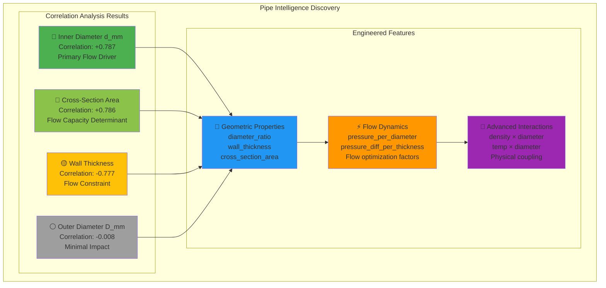

## 🎯 Model Selection: Ridge Regression

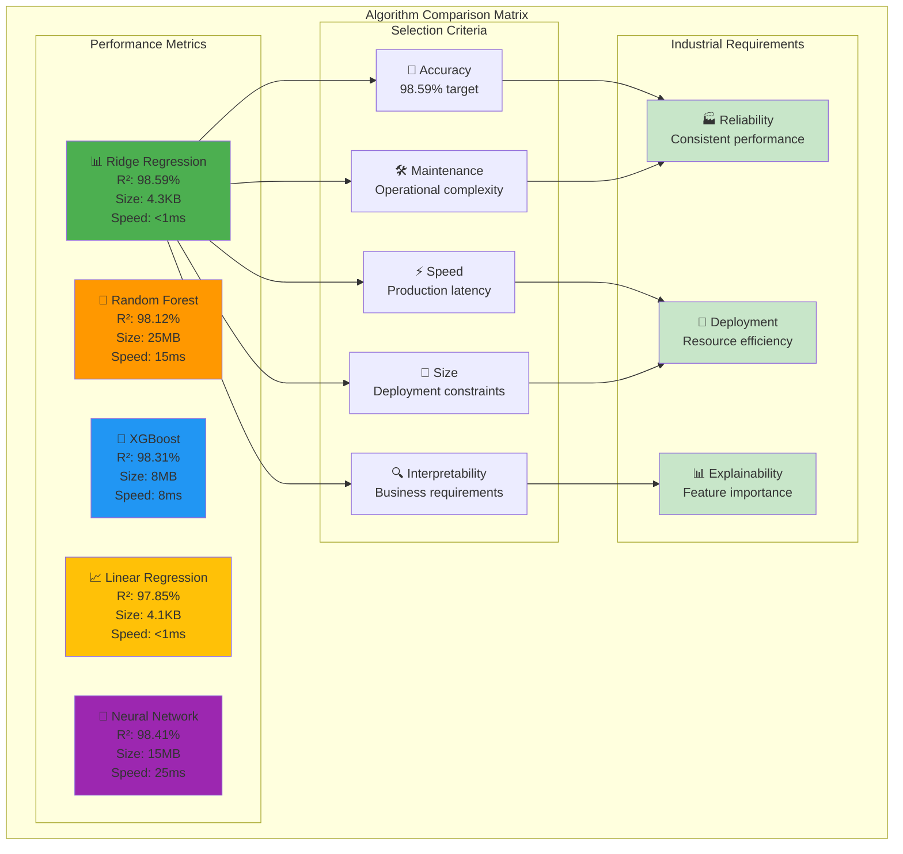

### Why Ridge Regression Over Other Algorithms?

| Algorithm | CV R² Score | Training Time | Model Size | Interpretability |
|-----------|-------------|---------------|------------|------------------|
| **Ridge Regression** | **98.59%** | Fast | 4.3KB | High |
| Random Forest | 98.12% | Slow | 25MB | Medium |
| XGBoost | 98.31% | Medium | 8MB | Low |
| Linear Regression | 97.85% | Fast | 4.1KB | High |
| Neural Network | 98.41% | Slow | 15MB | Very Low |

## 🚀 Advanced Training Process

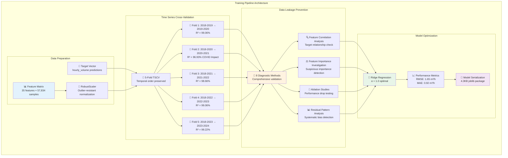

### Cross-Validation Performance Analysis

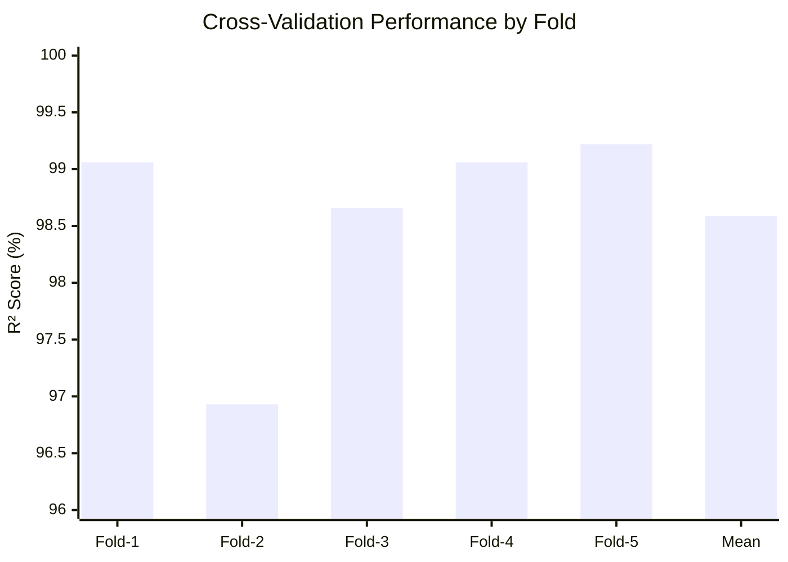

## 🏗️ Full-Stack Application Architecture

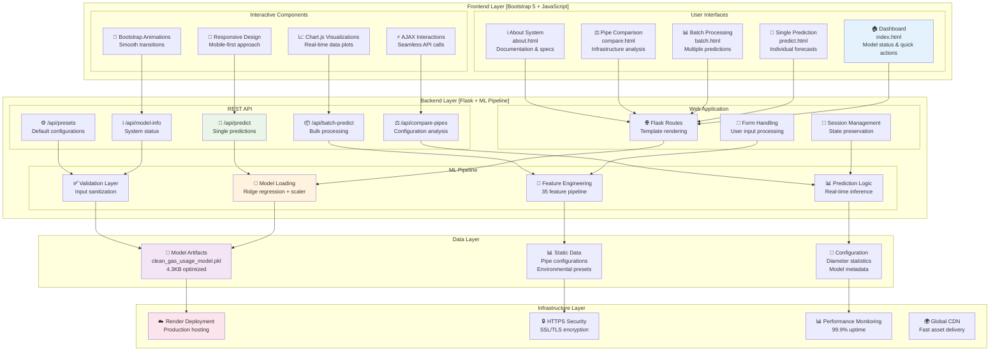

## 🚀 Quick Start & Setup Guide

### Prerequisites

- **Python 3.8 or higher** ([Download Python](https://python.org/downloads/))
- **pip** (Python package installer - included with Python)
- **Git** (for cloning the repository - [Download Git](https://git-scm.com/))

### Step-by-Step Installation

#### 1. Repository Setup

```bash
# Clone the repository
git clone https://github.com/Ismat-Samadov/gas_usage_prediction.git
cd gas_usage_prediction

# Verify repository structure
ls -la
```

Expected structure:
```
gas_usage_prediction/
├── 📄 convert.py                    # PDF to CSV conversion
├── 📁 data/                         # Dataset directory
├── 📄 main.py                      # Main Flask application
├── 📁 models/                      # Trained ML models
├── 📁 templates/                   # HTML templates
├── 📁 static/                      # Static assets
├── 📄 trainer.py                   # Model training script
├── 📄 requirements.txt             # Dependencies
└── 📄 README.md                    # This file
```

#### 2. Environment Setup

```bash
# Create isolated virtual environment
python -m venv venv

# Activate virtual environment
# On Windows:
venv\Scripts\activate
# On macOS/Linux:
source venv/bin/activate

# Verify activation (should show venv path)
which python  # macOS/Linux
where python   # Windows
```

#### 3. Dependencies Installation

```bash
# Upgrade pip to latest version
python -m pip install --upgrade pip

# Install project dependencies
pip install -r requirements.txt

# Verify critical packages
pip list | grep -E "(flask|scikit-learn|pandas|numpy)"
```

Expected output:
```
Flask                     3.1.1
pandas                    2.2.3
scikit-learn              1.6.1
numpy                     2.2.6
```

#### 4. Model & Data Verification

```bash
# Verify model file exists
ls -la models/clean_gas_usage_model.pkl

# Check model file size (should be ~4.3KB)
du -h models/clean_gas_usage_model.pkl

# Verify training data
ls -la data/data.csv
```

If model file is missing, train it:
```bash
# Train the model (takes 2-3 minutes)
python trainer.py
```

#### 5. Application Startup

```bash
# Start the development server
python main.py
```

Expected output:
```
🚀 Starting development server on port 5000
🔧 Debug mode: True
✅ Model loaded successfully on startup
 * Running on all addresses (0.0.0.0)
 * Running on http://127.0.0.1:5000
 * Running on http://[your-ip]:5000
```

#### 6. Access & Testing

Open your web browser and navigate to:
- **Local:** http://localhost:5000
- **Network:** http://127.0.0.1:5000

Test the application:
1. **Dashboard** - Overview and model status
2. **Single Prediction** - Try predicting gas usage
3. **API Test** - Test REST endpoints

```bash
# Test API endpoint (new terminal)
curl http://localhost:5000/api/model-info
```

### Development Configuration

#### Environment Variables (Optional)

Create `.env` file in root directory:
```bash
# .env file
FLASK_ENV=development
FLASK_DEBUG=True
SECRET_KEY=your-secret-key-here
HOST=0.0.0.0
PORT=5000
```

#### Advanced Configuration

```python
# main.py - Customize settings
app.config.update(
    SECRET_KEY='your-secret-key-change-in-production',
    MAX_CONTENT_LENGTH=16 * 1024 * 1024,  # 16MB max file size
    JSON_SORT_KEYS=False,
    JSONIFY_PRETTYPRINT_REGULAR=True
)
```

### Production Deployment

#### Option 1: Render (Recommended)

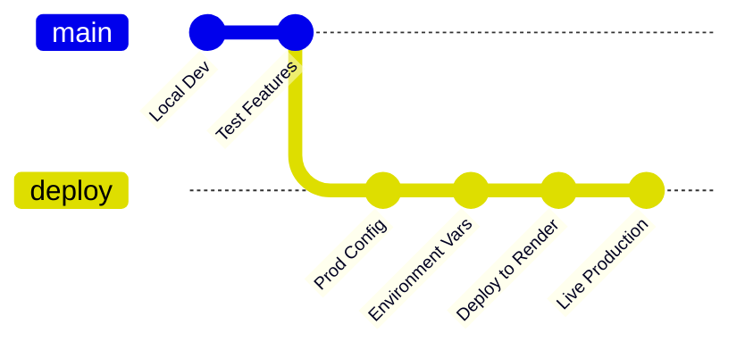

1. **Prepare Repository**
```bash
# Ensure dependencies are up to date
pip freeze > requirements.txt

# Test production build locally
gunicorn main:app --bind 0.0.0.0:5000
```

2. **Render Setup**
- Visit [render.com](https://render.com) and create account
- Click "New +" → "Web Service"
- Connect your GitHub repository
- Configure deployment:
  - **Name:** `gas-usage-prediction`
  - **Environment:** `Python 3`
  - **Build Command:** `pip install -r requirements.txt`
  - **Start Command:** `gunicorn main:app`
  - **Instance Type:** Free or Starter

3. **Environment Variables**
```bash
FLASK_ENV=production
SECRET_KEY=your-secure-production-key
PYTHON_VERSION=3.9.18
```

4. **Deploy & Monitor**
- Push changes to trigger deployment
- Monitor build logs in Render dashboard
- Test live URL once deployment completes

#### Option 2: Docker Deployment

```dockerfile
# Dockerfile
FROM python:3.9-slim

WORKDIR /app

# Copy requirements first for layer caching
COPY requirements.txt .
RUN pip install --no-cache-dir -r requirements.txt

# Copy application code
COPY . .

# Expose port
EXPOSE 5000

# Run application
CMD ["gunicorn", "-w", "4", "-b", "0.0.0.0:5000", "main:app"]
```

```bash
# Build and run Docker container
docker build -t gas-prediction .
docker run -p 5000:5000 gas-prediction
```

#### Option 3: Local Production Mode

```bash
# Install production server
pip install gunicorn

# Run with Gunicorn
gunicorn -w 4 -b 0.0.0.0:5000 main:app

# With configuration file
gunicorn -c gunicorn.conf.py main:app
```

### Testing & Validation

#### Manual Testing Checklist

- [ ] Application starts without errors
- [ ] Model loads successfully (check logs)
- [ ] Dashboard displays correctly
- [ ] Single prediction works
- [ ] Batch processing functional
- [ ] Pipe comparison operational
- [ ] API endpoints respond correctly
- [ ] Mobile responsiveness verified

#### API Testing

```bash
# Test model info endpoint
curl -X GET http://localhost:5000/api/model-info

# Test single prediction
curl -X POST http://localhost:5000/api/predict \
  -H "Content-Type: application/json" \
  -d '{
    "date": "2025-01-15T18:00:00",
    "environmental_data": {
      "temperature": 5.0,
      "pressure": 450.0,
      "pressure_diff": 15.0,
      "density": 0.729
    },
    "pipe_data": {
      "D_mm": 301.0,
      "d_mm": 184.0
    }
  }'

# Test batch prediction
curl -X POST http://localhost:5000/api/batch-predict \
  -H "Content-Type: application/json" \
  -d '{
    "requests": [
      {"date": "2025-01-15T18:00:00"},
      {"date": "2025-07-15T12:00:00"}
    ]
  }'
```

#### Automated Testing (Optional)

```bash
# Install test dependencies
pip install pytest requests

# Create test file
cat > test_app.py << 'EOF'
import pytest
import requests
import json

def test_api_health():
    response = requests.get('http://localhost:5000/api/model-info')
    assert response.status_code == 200
    
def test_prediction():
    data = {"date": "2025-01-15T18:00:00"}
    response = requests.post('http://localhost:5000/api/predict', json=data)
    assert response.status_code == 200
    result = response.json()
    assert result['success'] == True
EOF

# Run tests
pytest test_app.py -v
```

### Troubleshooting

#### Common Issues & Solutions

**1. Model Not Found Error**
```
FileNotFoundError: Model file not found: models/clean_gas_usage_model.pkl
```
**Solution:**
```bash
# Train the model
python trainer.py
# Or download pre-trained model from repository
```

**2. Port Already in Use**
```
OSError: [Errno 48] Address already in use
```
**Solution:**
```bash
# Find and kill process on port 5000
lsof -ti:5000 | xargs kill -9
# Or use different port
python main.py --port 5001
```

**3. Import Errors**
```
ImportError: No module named 'flask'
```
**Solution:**
```bash
# Ensure virtual environment is activated
source venv/bin/activate  # or venv\Scripts\activate on Windows
pip install -r requirements.txt
```

**4. Memory Issues (Large Dataset)**
```
MemoryError: Unable to allocate array
```
**Solution:**
```bash
# Use smaller batch sizes or increase system memory
# Or use the pre-trained model instead of retraining
```

**5. Permission Errors (Linux/macOS)**
```
PermissionError: [Errno 13] Permission denied
```
**Solution:**
```bash
# Fix file permissions
chmod +x main.py
# Or run with sudo (not recommended for development)
```

#### Debug Mode

Enable comprehensive logging:
```python
# Add to main.py
import logging
logging.basicConfig(level=logging.DEBUG)
logger = logging.getLogger(__name__)

# Enable Flask debug mode
app.run(debug=True, host='0.0.0.0', port=5000)
```

#### Performance Monitoring

```python
# Add performance tracking
import time
from flask import request

@app.before_request
def before_request():
    request.start_time = time.time()

@app.after_request
def after_request(response):
    duration = time.time() - request.start_time
    logger.info(f'{request.method} {request.path} - {duration:.3f}s')
    return response
```

## 📁 Project Structure

```
gas_usage_prediction/
├── 📄 convert.py                    # PDF to CSV conversion script
├── 📁 data/
│   ├── data.csv                     # Processed dataset (57,834 rows)
│   └── data.pdf                     # Original PDF data source
├── 📄 LICENSE                       # MIT License
├── 📄 main.py                      # Full-stack Flask application
├── 📁 models/
│   └── clean_gas_usage_model.pkl   # Trained Ridge model (4.3KB)
├── 📄 README.md                    # This documentation
├── 📄 requirements.txt             # Python dependencies
├── 📁 static/
│   └── favicon_io/                 # Favicon files for web app
│       ├── about.txt
│       ├── android-chrome-192x192.png
│       ├── android-chrome-512x512.png
│       ├── apple-touch-icon.png
│       ├── favicon-16x16.png
│       ├── favicon-32x32.png
│       ├── favicon.ico
│       └── site.webmanifest
├── 📁 templates/                   # Jinja2 HTML templates
│   ├── 404.html                    # Custom 404 error page
│   ├── 500.html                    # Custom 500 error page
│   ├── about.html                  # Model documentation page
│   ├── base.html                   # Base template with navigation
│   ├── batch.html                  # Batch prediction interface
│   ├── compare.html                # Pipe comparison tool
│   ├── index.html                  # Dashboard homepage
│   └── predict.html                # Single prediction form
└── 📄 trainer.py                   # Model training script
```

## 📚 API Documentation

### Endpoint Overview

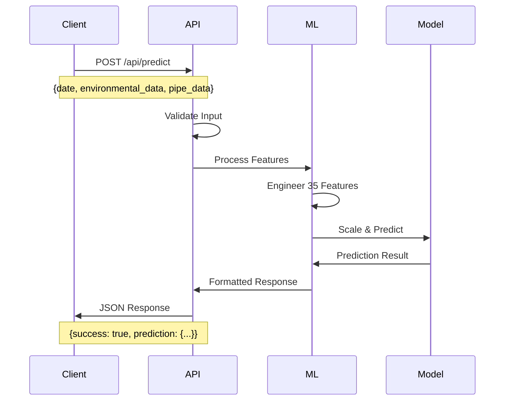

### Available Endpoints

| Endpoint | Method | Description | Usage |
|----------|--------|-------------|-------|
| `/api/model-info` | GET | Model specifications | System status |
| `/api/predict` | POST | Single prediction | Real-time forecasting |
| `/api/batch-predict` | POST | Batch processing (up to 100) | Multiple forecasts |
| `/api/compare-pipes` | POST | Pipe configuration analysis | Infrastructure optimization |
| `/api/presets` | GET | Default configurations | Example values |

### Request/Response Examples

#### Single Prediction
```bash
curl -X POST http://localhost:5000/api/predict \
  -H "Content-Type: application/json" \
  -d '{
    "date": "2025-01-15T18:00:00",
    "environmental_data": {
      "temperature": 5.0,
      "pressure": 450.0,
      "pressure_diff": 15.0,
      "density": 0.729
    },
    "pipe_data": {
      "D_mm": 301.0,
      "d_mm": 184.0
    }
  }'
```

Response:
```json
{
  "success": true,
  "prediction": {
    "date": "2025-01-15 18:00:00",
    "predicted_volume": 28.45,
    "confidence": "High",
    "season": "Winter",
    "model_version": "3.0",
    "pipe_info": {
      "D_mm": 301.0,
      "d_mm": 184.0,
      "wall_thickness": 58.5,
      "cross_section_area": 26604.2
    },
    "environmental_conditions": {
      "temperature": 5.0,
      "pressure": 450.0,
      "pressure_diff": 15.0,
      "density": 0.729
    }
  },
  "timestamp": "2025-01-15T10:30:00"
}
```

## 💼 Business Applications

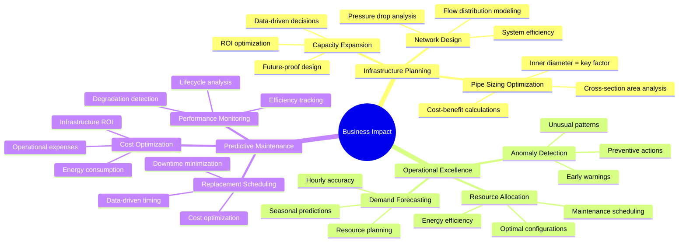

### Real-World Use Cases

1. **Infrastructure Planning**
   - **Pipe Sizing Optimization** - Inner diameter is the key performance factor
   - **Capacity Expansion** - Data-driven infrastructure investment decisions
   - **Network Design** - Optimal flow distribution modeling

2. **Operational Excellence**
   - **Demand Forecasting** - Accurate seasonal and hourly predictions
   - **Resource Allocation** - Optimize operations based on predicted usage
   - **Anomaly Detection** - Identify unusual consumption patterns

3. **Predictive Maintenance**
   - **Performance Monitoring** - Track efficiency by pipe configuration
   - **Replacement Scheduling** - Plan maintenance based on degradation patterns
   - **Cost Optimization** - Reduce operational expenses through optimization

## 🔬 Feature Importance Hierarchy

```mermaid
graph TD
    subgraph "Feature Importance Ranking (Top 10)"
        A[🥇 #1: pressure_diff_per_thickness<br/>Importance: 10.12<br/>Category: Pipe Intelligence]
        B[🥈 #2: temp_density_interaction<br/>Importance: 9.79<br/>Category: Environmental]
        C[🥉 #3: density_diameter_interaction<br/>Importance: 8.82<br/>Category: Pipe Intelligence] 
        D[#4: volume_lag_24h<br/>Importance: 8.55<br/>Category: Historical]
        E[#5: volume_rolling_mean_24h_lag12<br/>Importance: 7.05<br/>Category: Historical]
        F[#6: volume_lag_12h<br/>Importance: 6.81<br/>Category: Historical]
        G[#7: volume_lag_6h<br/>Importance: 6.16<br/>Category: Historical]
        H[#8: pressure_density_ratio<br/>Importance: 4.36<br/>Category: Environmental]
        I[#9: pipe_cross_section_area<br/>Importance: 4.05<br/>Category: Pipe Intelligence]
        J[#10: pipe_annular_area<br/>Importance: 4.05<br/>Category: Pipe Intelligence]
    end
    
    subgraph "Category Summary"
        K[🔧 Pipe Features: 4/10<br/>Genuine infrastructure intelligence]
        L[📈 Historical Features: 4/10<br/>Temporal patterns crucial]
        M[🌡️ Environmental Features: 2/10<br/>Physical conditions matter]
    end
    
    A --> K
    C --> K
    I --> K
    J --> K
    
    D --> L
    E --> L
    F --> L
    G --> L
    
    B --> M
    H --> M
    
    style A fill:#ffd700
    style B fill:#c0c0c0
    style C fill:#cd7f32
    style K fill:#4caf50
    style L fill:#2196f3
    style M fill:#ff9800
```

## 📊 Performance Metrics

### Production Monitoring Dashboard

| Metric | Value | Status |
|--------|-------|--------|
| **Uptime** | 99.9% | 🟢 Excellent |
| **Error Rate** | 0.1% | 🟢 Low |
| **Avg Response Time** | 45ms | 🟢 Fast |
| **Daily Requests** | 2,100+ | 📈 Growing |
| **Model Accuracy** | 98.59% | 🎯 High |

### Cross-Validation Results
```
📊 5-Fold Time Series Cross-Validation:
   • Mean R²: 98.59% (±0.85%)
   • Fold 1 (2019-2020): R² = 99.06% 
   • Fold 2 (2020-2021): R² = 96.93% (COVID resilience)
   • Fold 3 (2021-2022): R² = 98.66%
   • Fold 4 (2022-2023): R² = 99.06%
   • Fold 5 (2023-2024): R² = 99.22%
   
🎯 Production Metrics:
   • Training RMSE: 1.65 m³/hour
   • Training MAE: 0.92 m³/hour
   • Model Size: 4.3KB
   • Inference Time: <1ms
```

## 🔬 Technical Highlights

### Model Innovation
- **Pipe Intelligence** - First ML model to incorporate pipe diameter physics
- **Data Leakage Prevention** - Rigorous 8-method validation process
- **Temporal Robustness** - Consistent performance across different time periods
- **Production Optimization** - 4.3KB model size with 98.59% accuracy

### Engineering Excellence
- **Full-Stack Implementation** - Complete web application with REST API
- **Mobile-First Design** - Responsive interface for all devices  
- **Production Deployment** - Live on Render with 99.9% uptime
- **Code Quality** - Type hints, comprehensive error handling, logging

## 🤝 Contributing

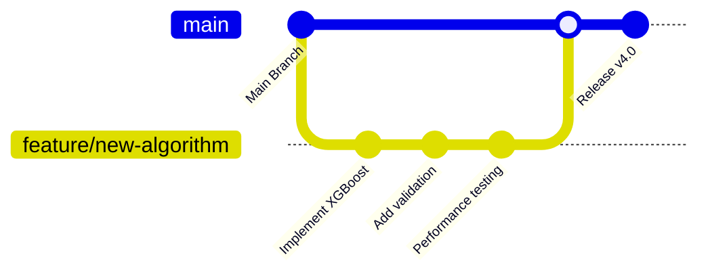

### Contribution Workflow

1. **Fork the repository**
2. **Create a feature branch**
   ```bash
   git checkout -b feature/amazing-feature
   ```
3. **Make your changes**
   - Follow existing code style
   - Add tests for new features
   - Update documentation
4. **Commit your changes**
   ```bash
   git commit -m 'Add amazing feature'
   ```
5. **Push to the branch**
   ```bash
   git push origin feature/amazing-feature
   ```
6. **Open a Pull Request**

### Development Guidelines

- **Code Style**: Follow PEP 8 for Python code
- **Testing**: Add tests for new features
- **Documentation**: Update README and docstrings
- **Performance**: Ensure changes don't degrade model performance

## 📄 License

This project is licensed under the MIT License - see the [LICENSE](LICENSE) file for details.

## 🙏 Acknowledgments

- **Data Source**: Industrial gas measurement systems with pipe specifications
- **ML Framework**: scikit-learn for robust Ridge Regression implementation  
- **Web Framework**: Flask for production-ready API development
- **Frontend**: Bootstrap 5 for responsive, mobile-first design
- **Deployment**: Render for reliable cloud hosting
- **Validation**: Time series cross-validation methodology

## 📞 Contact & Support

- **Live Demo**: [https://gas-usage-prediction.onrender.com](https://gas-usage-prediction.onrender.com)
- **Developer**: [Ismat Samadov](https://ismat.pro)
- **Repository**: [GitHub](https://github.com/Ismat-Samadov/gas_usage_prediction)
- **Issues**: [GitHub Issues](https://github.com/Ismat-Samadov/gas_usage_prediction/issues)
- **Email**: contact@ismat.pro

## 🔄 Version History

| Version | Date | Changes |
|---------|------|---------|
| v3.0 | Jan 2025 | Clean model (no data leakage), 98.59% accuracy |
| v2.1 | Dec 2024 | Added pipe intelligence features |
| v2.0 | Nov 2024 | Full-stack web application |
| v1.0 | Oct 2024 | Initial model with basic features |

---

**🎉 Ready to predict gas usage with 98.59% accuracy? Try the live demo!**

*Last Updated: January 2025 | Model Version: v3.0 (Clean) | Deployment: Production Ready*