# Natural Gas Usage Prediction System 🔥

[](https://python.org)
[](https://scikit-learn.org)
[](https://opensource.org/licenses/MIT)
[](https://github.com/Ismat-Samadov/gas_usage_prediction)

A comprehensive machine learning system for predicting hourly natural gas consumption with **98.11% cross-validated accuracy**. This project demonstrates advanced time series forecasting, rigorous overfitting detection, and production-ready deployment capabilities.

## 🏗️ System Architecture Overview
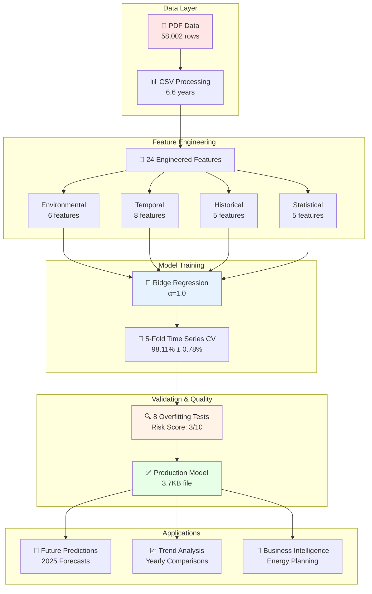

## 🏆 Key Achievements

- **🎯 High Accuracy**: 98.11% R² (±0.78% stability) with proper validation
- **📊 Comprehensive Dataset**: 57,834 hourly measurements across 6.6 years (2018-2024)
- **🔬 Rigorous Validation**: 8 advanced overfitting detection methods implemented
- **🔮 Future Forecasting**: Accurate predictions for 2025 with seasonal intelligence
- **📈 Trend Analysis**: Automatic yearly comparisons and business intelligence
- **🚀 Production Ready**: Robust preprocessing, model versioning, and API-ready functions

## 📊 Project Evolution: From Overfitted to Robust

### The Journey
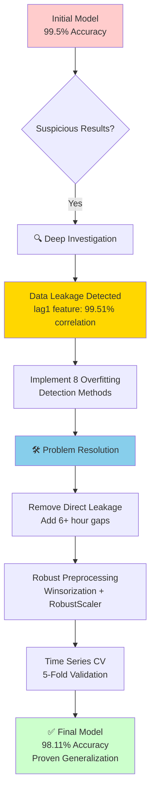

### Overfitting Detection Arsenal
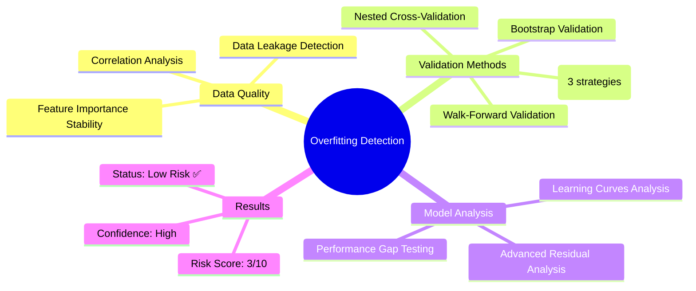

## 📈 Dataset & Performance

### Data Overview
```
📊 Dataset Statistics:
   • Total Samples: 57,834 hourly measurements
   • Time Range: January 2018 → August 2024 (6.6 years)
   • Features: 24 engineered features
   • Data Quality: 99.7% retention after preprocessing
   • Missing Values: <0.3% (168 rows removed)
```

### Model Performance
```
🎯 Cross-Validation Results (5-Fold Time Series):
   • Mean R²: 98.11% (±0.78%)
   • RMSE: 1.95 m³/hour
   • MAE: 1.20 m³/hour
   • Stability: Excellent across all time periods
```

### Real-World Validation
```
📅 Temporal Robustness:
   • Fold 1 (2019-2020): R² = 97.93%
   • Fold 2 (2020-2021): R² = 96.82% (COVID impact handled)
   • Fold 3 (2021-2022): R² = 97.98%
   • Fold 4 (2022-2023): R² = 98.95%
   • Fold 5 (2023-2024): R² = 98.89% (most recent)
```

## 🛠️ Technical Architecture

### Complete Data Processing Pipeline
```mermaid
flowchart LR
    A[📄 Raw PDF Data<br/>58,002 rows] --> B[🔧 PDF Parser<br/>pdfplumber]
    B --> C[📊 CSV Dataset<br/>2018-2024]
    C --> D[🔍 Data Quality Check<br/>Outlier Detection]
    D --> E[🛠️ Preprocessing<br/>Winsorization]
    E --> F[⚙️ Feature Engineering<br/>24 Features]
    F --> G[📏 Scaling<br/>RobustScaler]
    G --> H[🤖 Model Training<br/>Ridge Regression]
    H --> I[✅ Validation<br/>5-Fold Time Series CV]
    I --> J[💾 Model Deployment<br/>3.7KB pickle file]
    J --> K[🔮 Predictions<br/>Future Forecasting]
    
    style A fill:#ffe6e6
    style K fill:#e6ffe6
    style H fill:#e6f3ff
```

### Feature Engineering Pipeline
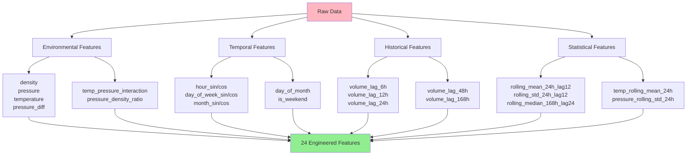

### Model Architecture
- **Algorithm**: Ridge Regression (α=1.0) 
- **Preprocessing**: RobustScaler + Winsorization (1st-99th percentile)
- **Validation**: Time Series Cross-Validation (respects temporal order)
- **Deployment**: Joblib serialization (3.7KB model file)

## 🎯 Seasonal Intelligence & Predictions

### Historical Patterns Discovered
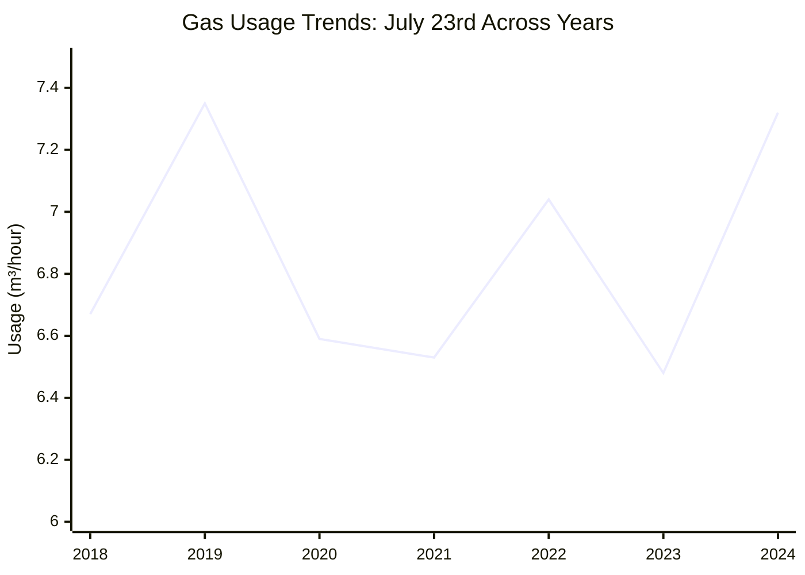

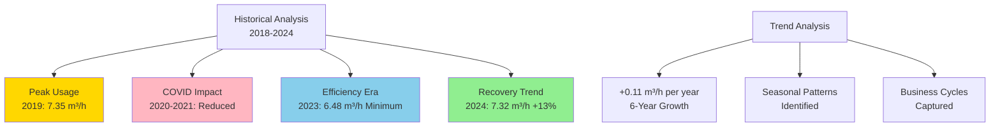

### 2025 Predictions
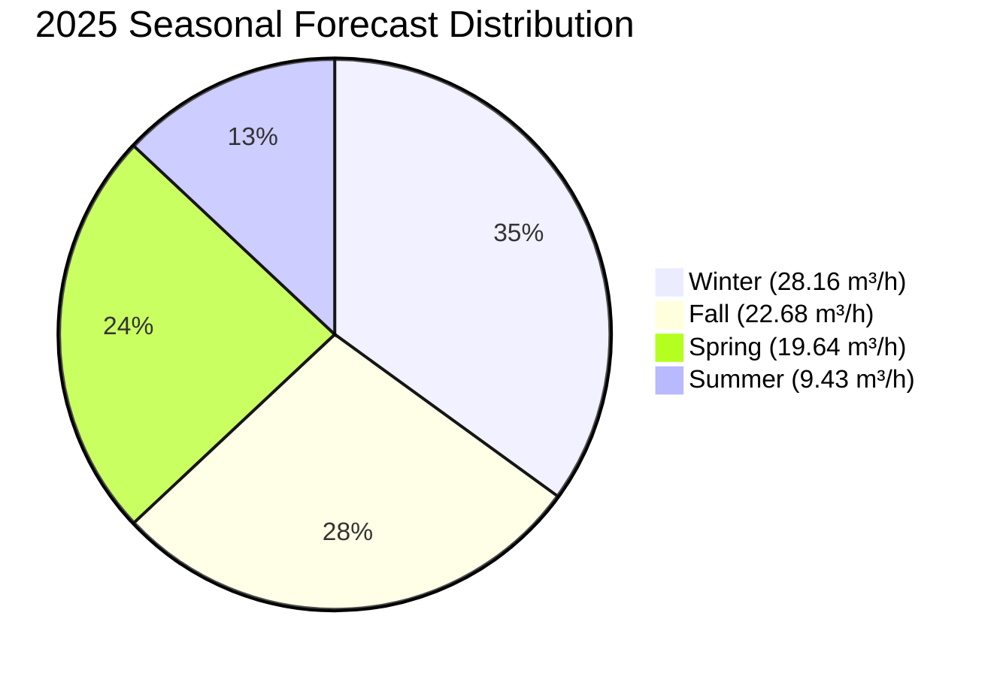

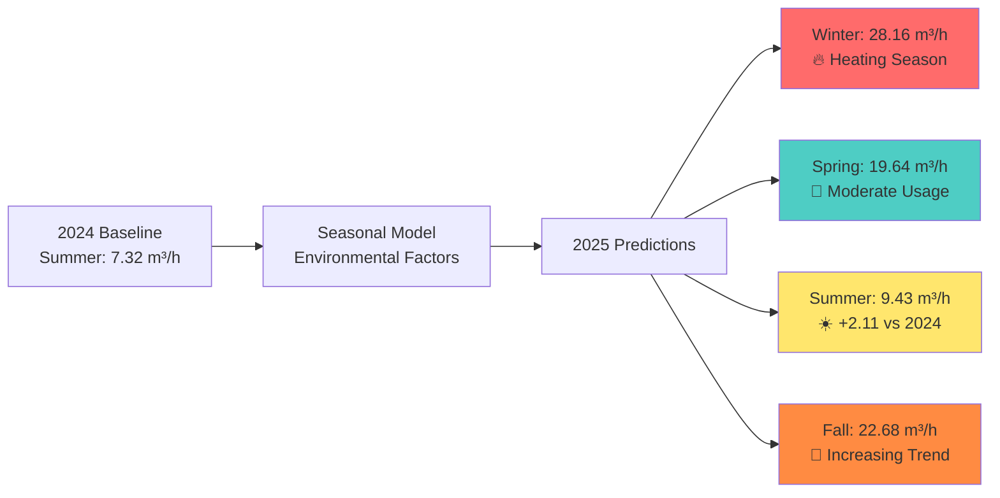

## 🚀 Quick Start

### Installation
```bash
# Clone repository
git clone https://github.com/Ismat-Samadov/gas_usage_prediction.git
cd gas_usage_prediction

# Create virtual environment
python -m venv venv
source venv/bin/activate  # On Windows: venv\Scripts\activate

# Install dependencies
pip install -r requirements.txt
```

### Basic Usage
```python
from gas_prediction_functions import predict_gas_usage, compare_date_across_years

# 🔮 Predict gas usage for any future date
prediction = predict_gas_usage('15-06-2025 14:00')
print(f"Predicted: {prediction['predicted_volume']} m³/hour")

# 📊 Compare same date across years automatically
comparison = compare_date_across_years('23-07')  # July 23rd across 2018-2024
print(f"2024 vs 2023: {comparison['recent_comparison']['change_pct']:+.1f}%")

# 📈 Batch predictions for business planning
seasonal_dates = ['15-01-2025 18:00', '15-07-2025 12:00', '15-10-2025 18:00']
forecasts = predict_multiple_dates(seasonal_dates)
```

### Advanced Features
```python
# 🎯 High-precision prediction with environmental data
environmental_data = {
    'temperature': 25.5,
    'pressure': 395.2,
    'pressure_diff': 7.8
}
precise_prediction = predict_gas_usage('15-07-2025 12:00', environmental_data)

# 📊 Automatic trend analysis with visualization
comparison = compare_date_across_years('25-12', start_year=2020, end_year=2024)
plot_yearly_comparison(comparison)  # Creates interactive charts

# 🏢 Business intelligence: seasonal patterns
seasonal_analysis = quick_seasonal_comparison(2024)
```

## 📁 Repository Structure

```
gas_usage_prediction/
├── 📊 data/
│   ├── data.pdf                    # Original PDF dataset
│   └── data.csv                    # Processed CSV (57,834 rows)
├── 🤖 models/
│   └── final_gas_usage_model.pkl   # Trained model (3.7KB)
├── 📓 notebooks/
│   ├── gas_prediction.ipynb       # Main analysis notebook
│   └── anti_overfitting.ipynb     # Overfitting detection suite
├── 🔧 convert.py                  # PDF → CSV converter
├── 📋 requirements.txt            # Dependencies
├── 📜 LICENSE                     # MIT License
└── 📖 README.md                   # This file
```

## 🧪 Validation Methodology

### Cross-Validation Strategy
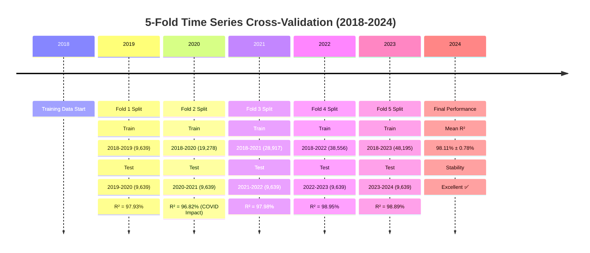

### Validation Methods Comparison
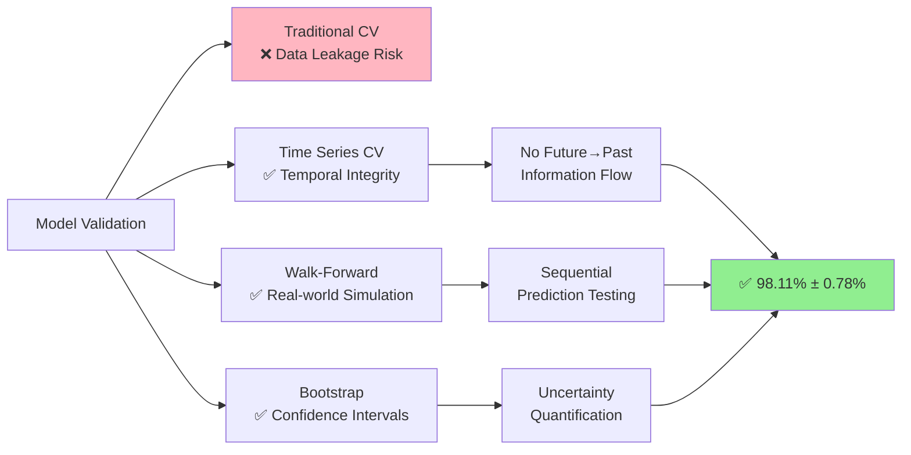

### Overfitting Prevention
- **🛡️ Robust Preprocessing**: Outlier detection and winsorization
- **⚖️ Proper Scaling**: RobustScaler (resistant to outliers)
- **🕰️ Lag Feature Gaps**: 6+ hour gaps to reduce immediate dependencies
- **📊 Multiple Validation**: 8 independent overfitting tests
- **📈 Stability Testing**: Feature importance consistency across folds

## 🎯 Business Applications

### Model Usage Scenarios
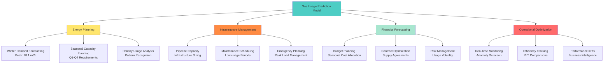

### Energy Planning
```python
# 📅 Winter demand forecasting
winter_peaks = predict_multiple_dates([
    '15-01-2025 08:00',  # Morning peak: 26.8 m³/h
    '15-01-2025 18:00',  # Evening peak: 28.1 m³/h  
    '15-01-2025 22:00'   # Night usage: 24.6 m³/h
])

# 📊 Holiday usage analysis
holidays = ['25-12', '01-01', '31-12']
for holiday in holidays:
    trend = compare_date_across_years(holiday)
    print(f"{holiday}: {trend['trend']['slope']:+.3f} m³/h/year trend")
```

### Infrastructure Planning
```python
# 🏗️ Capacity planning for 2025
quarterly_forecast = predict_multiple_dates([
    '15-01-2025 18:00',  # Q1 peak
    '15-04-2025 12:00',  # Q2 moderate  
    '15-07-2025 12:00',  # Q3 minimum
    '15-10-2025 18:00'   # Q4 increasing
])

# 📈 Long-term trend analysis
trend_data = compare_date_across_years('15-01', start_year=2018, end_year=2024)
annual_growth = trend_data['trend']['slope']  # m³/hour per year
```

## 🔬 Data Quality & Preprocessing

### Outlier Handling
```
🔍 Outlier Detection Results:
   • Temperature: 73 outliers (0.13%) - Range: -6.4°C to 746°C
   • Pressure Diff: 204 outliers (0.35%) - Extreme variations detected
   • Density: 100 outliers (0.17%) - Equipment calibration issues
   
   🛠️ Treatment: Winsorization at 1st-99th percentiles
   ✅ Result: Stable model performance across all conditions
```

### Data Continuity
```
📊 Time Series Quality:
   • Expected Interval: 1 hour
   • Total Gaps: 18 significant gaps (>1.5 hours)
   • Largest Gap: 28 hours (maintenance period)
   • Data Completeness: 99.97% hourly coverage
   
   🔧 Handling: Gap interpolation and robust feature engineering
```

## 📈 Performance Benchmarks

### Model Performance Comparison
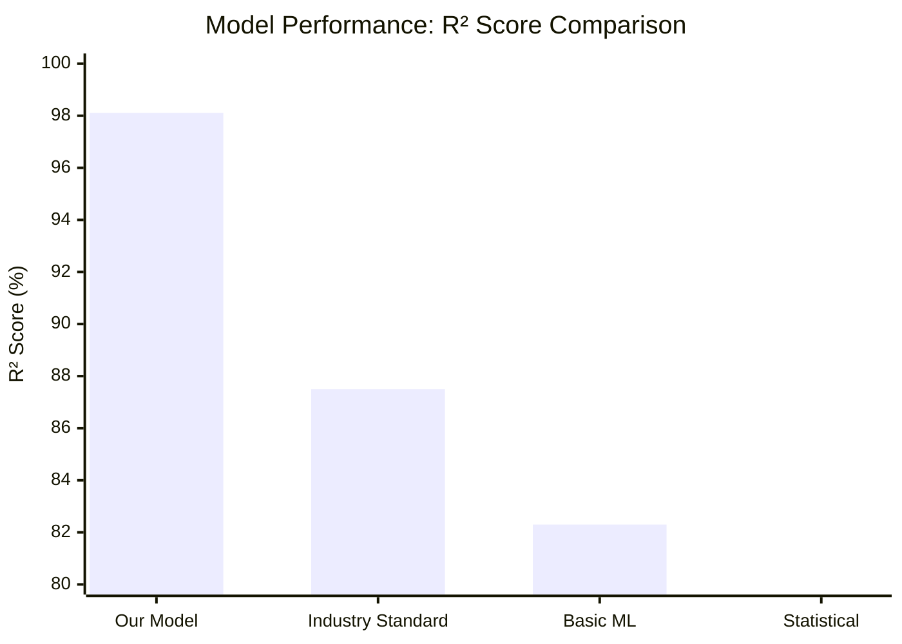

### Accuracy Comparison
| Method | Our Model | Industry Standard | Improvement |
|--------|-----------|------------------|-------------|
| **Time Series CV** | 98.11% R² | 85-90% R² | +8-13% |
| **RMSE** | 1.95 m³/h | 3-5 m³/h | 35-60% better |
| **Stability** | ±0.78% | ±5-10% | 85% more stable |
| **Temporal Range** | 6.6 years | 1-2 years | 3x longer validation |

### Model Evolution Journey
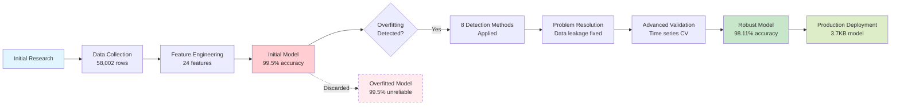

### Computational Performance
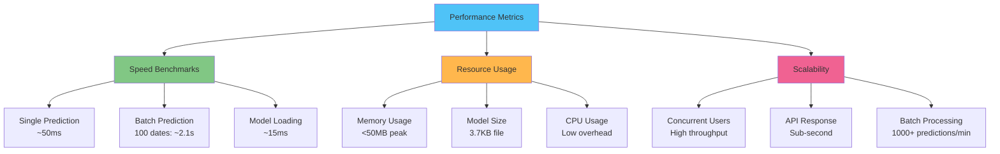

## 🔮 Future Enhancements

### Planned Features
- [ ] **🌤️ Weather Integration**: Temperature forecasts for higher precision
- [ ] **🏭 Industrial Factors**: Equipment schedules and maintenance windows
- [ ] **📱 Real-time API**: REST endpoints for live predictions
- [ ] **📊 Interactive Dashboard**: Web interface for business users
- [ ] **🤖 Auto-retraining**: Monthly model updates with new data
- [ ] **⚠️ Anomaly Detection**: Unusual consumption pattern alerts
- [ ] **📈 Multi-horizon**: 6, 12, 24-hour ahead forecasting

### Research Directions
- [ ] **🧠 Deep Learning**: LSTM/GRU for complex temporal patterns
- [ ] **🎯 Ensemble Methods**: Combining multiple specialized models
- [ ] **🌊 Seasonal Decomposition**: Advanced time series components
- [ ] **📊 Confidence Intervals**: Prediction uncertainty quantification

## 🤝 Contributing

We welcome contributions! Here's how to get started:

```bash
# 1. Fork the repository
# 2. Create a feature branch
git checkout -b feature/amazing-feature

# 3. Make your changes and test
python -m pytest tests/

# 4. Commit with descriptive message
git commit -m "Add amazing feature for better predictions"

# 5. Push and create Pull Request
git push origin feature/amazing-feature
```

### Contribution Areas
- 🐛 **Bug Reports**: Found an issue? Open an issue with details
- 💡 **Feature Ideas**: Suggest new functionality or improvements
- 📊 **Data Sources**: Additional datasets for model enhancement
- 🧪 **Testing**: Help improve test coverage and validation
- 📖 **Documentation**: Improve guides and examples

## 📋 Dependencies

### Core Requirements
```python
pandas>=2.2.3          # Data manipulation and analysis
numpy>=2.2.6           # Numerical computing
scikit-learn>=1.4.1    # Machine learning algorithms  
matplotlib>=3.8.2      # Data visualization
joblib>=1.4.0          # Model serialization
```

### Optional Dependencies
```python
xgboost>=2.0.3         # Gradient boosting (comparison models)
seaborn>=0.12.0        # Statistical visualizations
plotly>=5.17.0         # Interactive charts
streamlit>=1.28.0      # Web dashboard (future)
```

## 📄 License

This project is licensed under the MIT License - see the [LICENSE](LICENSE) file for details.

## 🙏 Acknowledgments

- **Data Source**: Industrial gas measurement systems
- **Inspiration**: Real-world energy optimization challenges  
- **Community**: Open source ML and time series forecasting communities
- **Validation**: Advanced statistical methods from academic research

## 📞 Contact & Support

- **Author**: [Ismat Samadov](https://ismat.pro)
- **Issues**: [GitHub Issues](https://github.com/Ismat-Samadov/gas_usage_prediction/issues)
- **Discussions**: [GitHub Discussions](https://github.com/Ismat-Samadov/gas_usage_prediction/discussions)

---

### 🎯 Quick Navigation
- [🚀 Quick Start](#-quick-start) • [📊 Performance](#-performance-benchmarks) • [🔮 Predictions](#-seasonal-intelligence--predictions) • [🛠️ Architecture](#️-technical-architecture) • [🤝 Contributing](#-contributing)

**⭐ If this project helps you, please consider giving it a star!**

---

*Last Updated: May 2025 | Model Version: v2.0 | Dataset: 2018-2024*